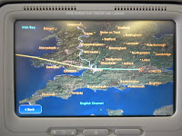
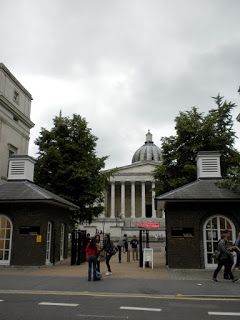

Finally after too many hours of waiting and travel, we arrived in London. The flight to JFK was delayed a little bit, but once we got there we had about 3 hours to eat and move around as much as possible before the flight to London. I paid over $11 for a ham and cheese sandwich and a bottle of water. sweet! Boarding the plane wasn't too bad, but then again it wasn't a huge plane. It didn't take that long, and I was excited to get going, but of course we then sat on the runway for 2 hours before finally taking off. Since we were on the runway, we weren't allowed to listen to ipods or play with the personal screen we all had in front of us.(the flight attendants weren't very nice about it either). Finally we took off. The flight was a lot better than I was expecting. We ate dinner, I watched an episode of Dexter, started the new Alice in Wonderland, and played games on the little tv, slept for a few hours, woke up started watching 'When in Rome' (thankfully I had to stop). After making at least 2 huge circles around Heathrow, we landed. Then it was on to border control, baggage claim, waiting for the rest of the group, and then the bus. After landing at around 8am, we left the airport at 10, and took an hour to get to Astor College. It was really cool seeing different parts of London as we drove by. After unpacking I took a shower, then it was time to eat lunch in Ramsay Hall (where Coldplay met). it's 2 blocks away, and a very easy walk. After that, I went to get my internet set up, then back to Ramsay for our orientation. After, we went on a tour of the surrounding area. It's amazing how close everything is here. After the tour a lot of people went to Tesco to use the £20 gift card we get every week. Everything in there seems amazingly cheap. Especially Tesco brand things. I used a little more than half the gift card and got a lot with it. Once I got back to Astor, it was about time to have dinner. It was fish and chips...I'm not a fish fan at all, but I tried it. My favorite part is the chips. Once dinner was over, we made plans to find a place to watch the England game. The first place we had in mind was full, so we ended up walking around and found "Blues" which is not even a block down the street. After standing there for not even an hour, I was so dizzy and tired, so I came back to Astor and finally went to sleep!

