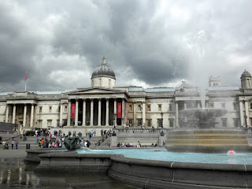

Today after breakfast, it was time to start the "Photo Frenzy" scavenger hunt. Our list was: 1. A famous circus that has no animals 2. A famous garden that the opening scene of _My Fair Lady_ or *Pygmalion* takes place. 3. A London market scene 4. A pub named for a famous detective 5. A very tall man who dominates this famous square 6. A park so big you can't hide it. 7. A person who looks famous 8. A photo of your group with a policeman/woman 9. A photo of your group in a red telephone box 10. a pub with a funny name.

A few of these are very obvious and easy to get done, but after a day of getting lost, none of us cared to return back to Astor in time. Finding a restaurant that will take in 9 people was difficult, but we ended up eating at "Cafe Rouge", which was so great. We learned that tap water not only comes in tiny glasses with no ice, but they don't want to refill the pitcher of water they gave us (for 9 people mind you).

Later on once we actually turned in the pictures, all the girls went to Oxford Street to shop. There were so many people on the sidewalks, and in the stores. All the stores seem like the same size as they do in the US except here they have at least 3 levels...so they're a bit bigger. I think..After lots of shopping and realizing even sizes for dresses, shirts, and jeans are different as well, we needed some caffeine. We found a Starbucks on the second level of a store and I got some tea and a chocolate chip shortbread. Finally, familiar food! Once we got back to Astor, we went down the street and had Thai food for dinner. We got our food so fast! And since I didn't finish mine, I got a 'take away' box.

Once I got home from dinner, I called my friend Kelundra who was finishing up her program here, and took the tube to Euston to meet her. In "seeing Kelundra" fashion, I got lost trying to find her street since I took a different exit than what she normally takes. After a very long Piccell call later, I finally found her! She showed me her flat, which was really nice compared to my dorm. I met her friends, and then we all got back on the tube at Euston and went to Camden Town to find a place to go. I don't know where we ended up, but it was a disco and we just people watched the entire time. Since it was way after 12am, the tube was closed and we had to find a bus home. After riding a bus realizing we were in the wrong direction, we FINALLY found a stop near me.
