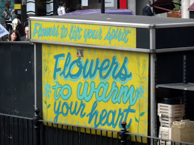

Today was the first day of classes. Since I'm only taking one, I didn't have anything to do in the morning. I wanted to find a bookstore, but failed, so I went to Paperchase, and Tesco. Once I got back I still had some time left to kill. I was planning to do this Tuesday, but couldn't wait any longer. So I got on the tube and rode it to Belsize Park. I walked down the street where Chris Martin lives, where that street ends, Fleet Street begins. On Fleet Street at the corner was The Beehive, where Coldplay is currently recording their new album. as I was walking, I saw someone leave the Beehive, and walk down the street and disappear. Where he disappeared was the Bakery! (where Coldplay recorded Viva La Vida or Death and All His Friends). I turned off the street, walked down another for a bit, then came back....and the same guy left the Bakery and went back to the Beehive! I hope he didn't think I was stalking..but I think he's Matt McGinn, the roadie who just wrote a book about being Coldplay's roadie since the beginning. I walked past the Martin abode again, and had to hurry back for lunch and class.

After class, I went to Waterloo with some friends and we rode a double decker to King's Cross. We attempted to see Platform 9 3/4, but they didn't want to scan their Oyster cards to get in. After, we took another bus to eat dinner with more people at the _Lord Moon Of The Mall. I had a BBQ sandwich that was delicious, and tried Pimms with lemonade. Once we got back to Astor, we went to the basement to watch the TV, but some guys were in there, so we found this pool table on steroids, which they call "sookie'. It has smaller balls, and more rules and meanings. After we were bored with it, we went to watch TV anyways and found out those guys were from Emory in Atlanta. Then a bunch of people from Hong Kong came in as well. Soon after, we all went to sleep._
