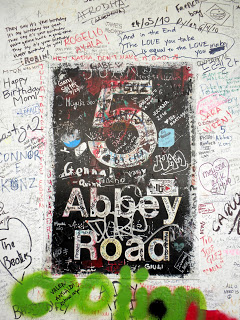

Today was my first free day. I went running with Kayla in Green Park, and we passed by Buckingham Palace. We walked up to it and saw 2 more girls from our program, but they were there for their field trip. It was almost time for changing of the guard, but we couldn't see anything, so we left. After a shower, I went to the Oxfam store, bought stamps, and bought lunch and an "iced coffee" at Cafe Nero. I took them to Regent's Park, and ate my lunch. After, I walked around a good bit of the park. On my way back to find my way home, I saw a Beatles store, and I realized I'm near Abbey Road..I just was unsure of where exactly it was. somewhere trying to find it, I found a Bobby, and asked for directions. I walked about a mile before I found it. I called my dad and he saw me on the Abbey RD Studios webcam. There are so many people who try to get their picture crossing the street, but it was so busy and splits off into 2 streets, so there were a lot of cars constantly. When I was done there, I found a bus and took it back, then the tube, back to Astor.

As soon as I got back, we went out to Oxford Street to find dinner. I finally went into Top Shop, which is like Forever 21 on crack, and bigger. We ate at this place called Garfunkel's which seemed like they were trying to be an American type restaurant. Once we got back, we all went to the basement to watch TV, and tons of people were down there and we just chilled with them until it was time to sleep.
