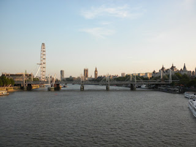

Since I didn't have anything to do until 12, I got up and went to the British Museum (also down the street). I just saw a few exhibits since not only is it free, but I'm going back there on a field trip with my class. After class, we had our afternoon tea, signed up for weekend excursions, and then went upstairs to plan a last minute trip to Amsterdam. We're going by way of train and ferry. It's much cheaper that way. After planning, we went to this Mexican restaurant by Charring Cross, and it was really good and REALLY fast. As soon as we ordered our food came out because they take orders on electronic pads, so as the waiter is still talking to us, my dinner was ready! After that I came back, and spent forever trying to find a place to stay in Amsterdam. After a long long while, I found a place!
