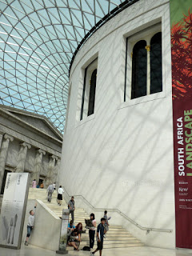

Today was a long day. My first field trip with my class started at 9:30. We went to the British Museum, and went to a few exhibits that have to do with what we're learning. Then we left and began our walk of "The City". We went east and saw many churches and old buildings. We stopped at Twinings and I was really excited we did. It is really tiny in there, but in the back there's a little museum of old things. I'm going to have to go back before I leave and buy some tea. For lunch we went to London's oldest pub, Ye Olde Cheshire Cheese. It was really good, and we ate downstairs where the ceilings were really low and I felt tall. After, we went to more churches, including St. Paul's. We made our way to the Museum of London, and I've noticed the City of London's logo is the same font as Coldplay's...interesting. On our way I saw 2 Play Me I'm Yours pianos, and people were playing both. Outside the museum, part of the London wall was still standing. The top floor of the museum was boring to me, but I really enjoyed the bottom floor since it was all from the 1900's on. By this time, I needed to leave to get back and pack and figure out what there is to do in Amsterdam...and then leave!

