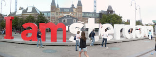

I just returned from our trip to Amsterdam. This is what we did: June 24 As soon as my field trip was over, I came back to Astor and started packing, and looking up where places were in Amsterdam and figured out how to get around there. Soon, Sara, Anna, Caroline, and I all went to Liverpool St. Station to get our tickets and get on our train to Harwich. After a few hours, we arrived and got on our "ferry" to Amsterdam. It was SO nice! It seemed more like a cruise ship! We had a room with 2 bunk beds, bathroom, tv, decent window. We dropped our stuff off there and went to the main floor and got food, drinks, gambled, and chilled. soon we went to bed (which was soo comfy). It was everyone's first sleepover on a boat!

June 25 After 5 hours of sleep, we had to get up and off the boat. We got more stamps on our passports, and went to get on our first train, and then switched to another in Rotterdam and an hour later we were in Amsterdam! We bought 48 hour bus/tram/subway passes and checked into our hotel. We tried to find a street market, and got very lost! (only to learn the next night the part of the map we were lost in and needed was in a tiny square on the back of the main map). After finding the market, we ate lunch then walked around the market for a while. After, we went back to the hotel, where 2 more girls from our trip were staying. We all wanted to go to the Van Gogh museum, so we went to that part of the city, but the line was too long, so we sat around at the I amsterdam sign, and then a bit later, Anna got sick, so we had to make our way back to the hotel. After a much needed nap, we woke up and walked around in search of a place to eat. After a while of searching with no luck, we decided at a restaurant that was on a corner in what seemed like a neighborhood. None of us could understand what to eat since there wasn't an english menu and the waitress didn't know how to translate the food names well. I wasn't really hungry so I asked for a big plate of chips. We learned sitting outside here that the sun doesn't go down until 10:30 PM! Crazy.  Once we were done, we found a convenience store type place and got some snacks, and went back to the hotel and watched David Letterman and Oprah and music videos until we fell asleep.

June 26 After we all woke up and got ready, we went downstairs to meet the other 2 girls from our program. One of them tried to get money out the ATM, but couldn't so they decided to stay back for a bit. So the rest of us got on a tram and headed towards the museums. We found a place to eat, and had brunch. More like lunch though. I ordered Ice Tea since it was on the menu...this was NOT ice tea! It was like some crazy sparkling water mess that was bad. After we were done, we went to go to the Van Gogh museum, but the line was long, so we went to go to the Rijksmuseum. They were doing construction on it and part of it was closed. Anna and Sara didn't want to go to it, so just Caroline and I went in. It said under 18 free...so I told the guy I was 17, and I got in free! (caroline had to pay). I'm glad I didn't pay, because there wasn't much open and it wasn't interesting. After, we all met up and went to the Van Gogh museum. It was a lot better than I had imagined. I absolutely LOVED it! After this, we went to the Heineken Experience. That was a neat tour, and we had a beer tasting, and then at the end we got 2 free beers (small). I only got one and didn't even finish that. After we were done here, we got on a tram to go to the middle of the city for food and tourist shops. After getting a few things and being weirded out, we got some amazing chips with mayo and attempted to find the Anne Frank house. After getting very lost and laughed at, we found it! It was about to close, but I was finally there, and had waited a long time to see this  house. I just couldn't believe all the things that happened to her, and that 2 families lived in the attic for so long, so quietly. It was also very sad and I just wanted to cry. After, it was getting late and we decided we could live without seeing the Red Light District. Once we got back to the hotel, we were all tired and just went to bed.

June 27 We woke up and left Amsterdam, much to my excitement. It took us 2 trains, a ferry ride that lasted years, and 2 more trains, and a tube ride but we made it back!
