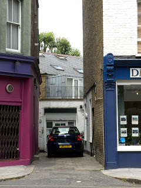

Today was my 2nd free day. I wasn't sure what I was about to do, but I packed a lunch and left Astor with a list of places I wanted to see, how to get there, and brought my BritRail pass just in case. I ended up going to Camden Town to check out these markets. Their markets are huge, there's so much to see and possibly buy. I was trying to go through so I could see parts I missed but eventually that just went out the window. I'm definitely  going to be going back! After I was done with the market, I started walking down Chalk Farm Road, and eventually ran into Parkhill...so of course I went down it, and I heard someone doing something on the other side of the gate of Chris Martin's house! Next I passed by the Beehive, then the Bakery, and I finally took a picture of it. I was trying to get to Hampstead Heath, but I got lost, but then found it eventually. (Camden has hills. So does Hampstead Heath!). I began walking around and finally climbed a hill and I could see some of the London skyline. This park was so different because it was more grown in, but people were still sitting on the grass. I figured there has to be a higher point so I kept walking and eventually was walking aimlessly. But I met a girl who lives here, and asked me where in Atlanta I was from. When I told her Dunwoody, she knew exactly where I was talking about and told me how she has family that lives in North Springs and that she lived in Atlanta for a summer. Talk about a small world! After we were both confused by the park, I saw the London Overground, and said bye to her. I rode it to Camden Street...then got lost trying to find where I came from. Finally I found a bus stop and rode it to Euston and took the tube home since I was so tired. When I got back, my friends said they were going to do laundry, so I decided I would too. right as we were going, this insane noise begins. It was the fire alarm! We had to go across the street and wait (a long time) for the Fire Dept. to come and check things out. They said it was good to go back in and we did. After finishing laundry, it was 7pm! It didn't seem that late. So we made dinner in the Astor kitchen, hoping not to cause another fire alarm. I made a grilled ham and cheese sandwich and it wasn't bad. Nice.
