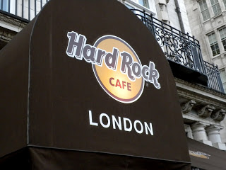

this morning, I woke up and went back to Covent Garden and bought a I heart London mug, a tea bag/spoon rest, and a union jack sticker. Once I got back I went to eat lunch, then to class. After class was our afternoon tea. After tea, a bunch of us went to the Tate Britain and walked around there. It wasn't all that great and there was a lot of weird things in the modern part. We got on the tube and went to eat at Hard Rock. We got there at 6:40, and waited until after 9!!! They said they buzzed us, but it didn't go off (and we were RIGHT there), so after giving them shit, we were seated and I ordered honey mustard grilled chicken sandwich. It was really good, and so were the chips. Then we came back and I went to bed.
