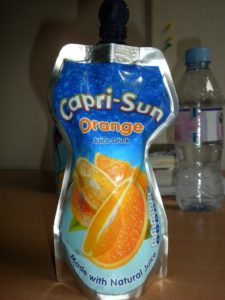

today I woke up and wasn't feeling all that great. I felt pretty tired, and my stomach hurt. I decided to take it easy in the morning, so I just uploaded pictures from yesterday and cleaned up my room a bit. When it was time for lunch, I went, had yet another meal that I can't really say what it was, and then came back. Class was..class, but I really like it though I feel like I'm actually learning a lot. Maybe it's because I'm just taking one? Or that we go on field trips every week that have to do with things  that we're learning. After class was the afternoon tea party, not too many people showed up, but it was still good. Then I came back to my room, and a few of us went to run errands. I got legit deodorant that's not strange, aka Dove. And got some 'fun' postcards for all my grandparents. And stopped at Tesco to buy more bread and sample another Cadbury product. I swear they come up with any reason to make something with chocolate. I love it.

We came back and I let Sara use my computer to upload her pics to facebook, then me, her, Ansley and Kayla all went to the Court to watch the football game, but it was too packed, so we came back and watched it in the basement. After Spain won, we went to the music room and played the pianos and later Chas came in and played and sang with his guitar for us. Then it was time for us to give back the key and to go to bed. Of course I've been in my room for 2 hours and am right now about to actually go to bed. But I've been busy skyping, making lunch/breakfast for tomorrow, all that good stuff. ok.
