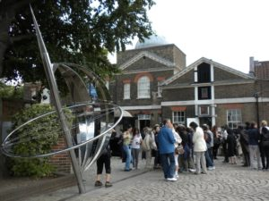

today was our last class field trip. sad face. we met in front of astor at 9:30, and magically it had stopped raining. the rest of the day's weather was just windy and in the 60's. we took the tube to embankment, and went to Embankment Pier to wait for our Thames Clipper. After 30 mins, it arrived and we got on. I guess 30 mins later we had made our way to Canary Wharf. There we went to the London Museum at the Docklands. It was interesting, for someone who's not really interested in docklands type things. But it related to the slave trade, which is what we're beginning to talk about.

After, we got on the Docklands Light Rail to Greenwich. There we had lunch, I went and got tea, and attempted to find a place to sit and eat, but had to stand and eat. After, we went to the Royal Naval College, then the National Maritime Museum, then finally the Royal Observatory. It was pretty neat, and I stood at 0 degrees, and set my watch to exactly GMT.

Once we had seen everything, a few of us headed back to Goodge, and I went back to Astor and took a very very much needed nap. Once I woke up, I just spent time planning the rest of my time here in London ( more sad face), and how to get to all these places, all those kinds of details. Now it's time to sleep. (again).
