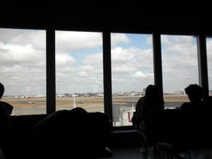
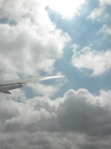

saddest day ever!

after going to sleep at 3:30 am, I set my alarm to wake me up at 4:30 am, but I kept snoozing, and Anna finally knocked on my door at 5am, to make sure I was awake. I made sure I was 99% packed before I went to sleep, so all I did when I woke up was change clothes, brushed my teeth and washed my face, and put the remaining things I left out in my bags. At 5:30, like we had planned, all the girls went to the boys rooms to say goodbye. We went to Chris's room first since his was on the other side, but he never answered, so we moved on to Fletcher's room, then to Patrick's where we discovered Chris had slept in there too (mattress and all).  It was pretty cute. After doing that, it was officially time to go downstairs. I got both of my suitcases, backpack and my backpack/purse, and went down. I turned in my key and then the bus pulled up and we all got on. after 25 mins of loading the bus and waiting on some last minute people, we left. Driving to Heathrow, we saw how close Madame Tussad's was when we thought it was sort of far away, when we could have walked! Seeing some things for the last time was so sad. But luckily at 6am it's bright outside, so it looked how we normally see it. When we arrived at Heathrow, we got our boarding passes, went through security, and began the waiting process. Our plane was already delayed an hour! After dropping our stuff off with some professors, we went to get some breakfast at Costa. After that we went back to the group and waited. Then I made one of the best decisions ever and bought a travel pillow. Oh My God! It was so great! I can't believe I went this long without one! I just thought they were silly. Definitely not!

The plane for JFK was pretty good, I slept a lot, watched Date Night, and parts of other movies that I didn't like. I also watched another episode of Dexter of course. Our lunch was alright, but before we landed (lunch again??) we were served pizza AND ice cream!  Tell me that's not the best airplane food ever! It was great.

When we got to JFK, we went to wait for our bags, then went through customs. This took an hour. After, we went to give them back our bags and to find the gate for our flight to Atlanta. We got on a train thing, then found we had to walk across a parking lot to the new terminal! what in the world! It was so muggy out. Once we got inside again, we had to go through security again! We had not even 45 minutes to do this. This was nerve racking. Eventually someone listened and let all 30 of us skip the line and go through security, and we ran to our gate, and boarded the plane. After boarding we sat on the runway for an hour, before getting in line to take off! Finally we took off, and 100miles from Atlanta, the captain says there's a storm in Atlanta and we can't land, so we'd circle for an hour until we'd have to go get gas somewhere else! That made us all so mad! Luckily that didn't happen and we landed around 8:45pm. We were in concourse T, so we just walked to baggage claim, where everyone's parents were waiting.

It was pretty nice to see my parents, my mom was trying not to cry! After a long wait for our bags, I finally got them and went aside to let Sara get her things out of our 2nd one. After, we were good to go and said goodbye to everyone and left. What was waiting in the car for me? A Chick-fil-a sweet tea in the cooler!! BEST THING EVER! and away we went back home.
