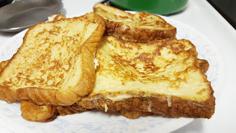

Happy Monday! It's Halloween Week! (Yes, I am quite excited for Halloween!)

It's time for another Weekly Wrap, here's what happened last week:

**Monday**

I worked from home since I was still feeling pretty crappy from the bug I had last weekend. Mac was super excited to sleep in bed all day while I worked.

**Tuesday**

I bought a refurbished [NetCam](http://amzn.to/1N1pNl2) last week, and set it up so I could finally see what Mac does all day while we're at work. He slept until 11, then looked out the window from the bed, then the floor, back to the bed, and took smaller naps in between. I unplugged it once I got home, I was checking my phone all day to see what he was up to. It got addicting...

**Wednesday**

In the morning, I attended the Atlanta Women in Technology Breakfast

Once I got back to work, I decided on my lunch break I would go to urgent care. My throat was killing me. Turns out I have fluid in my ears and am congested so that's why my throat hurts. I'm just glad I don't have strep or anything crazy!

**Thursday**

Nothing too crazy happened, but I hit 3,000 miles in my car!

Thursday night, we stayed home from the gym, caught up on shows and ate Chinese. Woo!

**Friday**

I did a [Friday Favs](http://thefittea.blogspot.com/2015/10/friday-favs.html) post, and after work I worked out and then went to dinner with my family and our out of town family that was here for the weekend!

**Saturday**

Early Saturday morning, my niece was born! No name yet!

We had french toast for breakfast, and later went to a Halloween party!

**Sunday**

I got to meet my niece!

So tiny! And she has a name! Stella Nova! 7lbs, 13oz and 20 inches.

**_How was your weekend?_**

Weekly Wrap with [HoHoRuns](http://hohoruns.blogspot.com/) & [MissSippiPiddlin](http://www.misssippipiddlin.com/)
