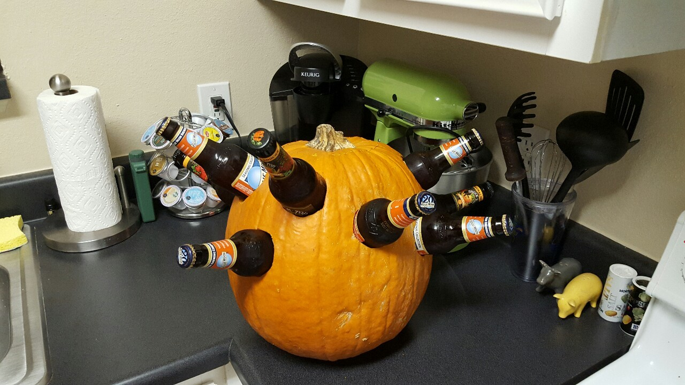
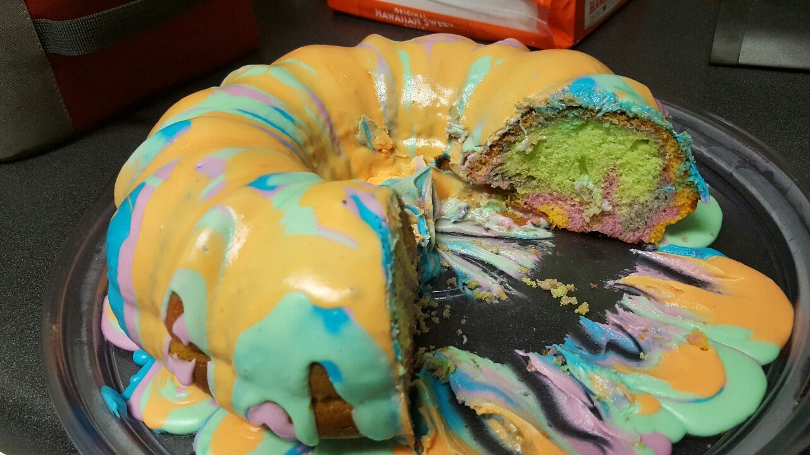
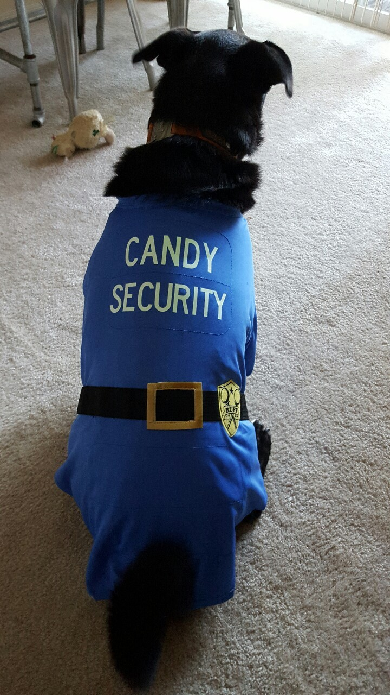

Happy Monday! I hope it's not as rainy where you are if you're not in Atlanta! It's time for another Weekly Wrap!

**Monday** Back to the gym! I was finally feeling better towards the end of the past weekend, and I was ready to workout again. Shaun and I did Total Body Fitness at our gym, then we grabbed some Moe's on the way home to eat while we watched the latest episode of The Walking Dead. We both had heard spoilers at work and online and needed to see what was up! (I just heard that last night's episode didn't make anyone feel any better so hopefully _next week's_ episode will!)

After we finished the episode, it was pumpkin carving time! I didn't realize until Tuesday that I had carved the Snapchat ghost...I thought it was the emoji ghost!! Social Media Fail!! (plus I don't like/understand Snapchat).

**Tuesday** It was so cold, windy, and rainy outside, that once I got home I didn't feel like going outside to workout. So we ordered Chinese. Not the best decision, but it felt like it at the time :) **Wednesday** I didn't want to just run when I worked out today, so I found some good circuit workouts on Pinterest and printed them out so they'd be easier to follow. [I started with this one](http://40.media.tumblr.com/tumblr_m0rxn9oJ7w1ql2uvyo1_1280.jpg), [And did this one twice](http://www.fitwirr.com/media/2014/08/28/After-burn-effect-high-intensity-circuit-workout.jpg). It was a really great workout, and I definitely felt it in my arms! Afterwards, I went to Whole Foods and got my brother & his growing family some pizzas for dinner! I also picked Shaun and I up one too. Have you had pizza from Whole Foods?? It's some of the best! **Thursday** When I got home from work and took Mac out, I took him to the back of our building and opened the gate and let him off his leash. As he was running around sniffing and doing his thing, I was thinking about how I never see the deer in the morning, and wondered where they usually hang out at. Right then, Mac ran to the edge of the woods where it drops off to the creek, and I see THREE deer start to scatter away on the other side!! Mac luckily didn't see them, and I called him back over to me. (Apparently these deer will attack dogs, I've heard!). I got a few pictures of them, but it was a little crazy!

A few hours later it was time for Total Body Fitness! It was a tough workout! I was thinking about doing the 2nd class, but they didn't do a 2nd one \*thankfully\*. I was definitely feeling good though! **Friday** No workout today, just a lot of running around getting ready for the Halloween party! **Saturday - Halloween!** Halloween is finally here! Shaun and I spent the day getting ready for the party. We had lunch at Pollo Tropical, and then went to Publix, Dollar Tree, Home Depot, Kroger, and a pumpkin patch down the street. Then once we got home, we cleaned up and put up the final decorations. Shaun bought a big pumpkin to carve out, put in dry ice and then put pumpkin beers in!

I made a Halloween cake! It didn't look like the pictures but still looked pretty neat, and was my 1st attempt at a multi-colored cake!

I also made Blood Orange Sangria. No pictures, but it was good!!

We got a tray of nuggets and chicken strips from Chick-fil-a, had cookies, candy, and a bunch of dips and things to dip! I think we threw a pretty good party if I do say so myself!

Oh, and we had Trick-or-Treaters!! I was very excited about this because we NEVER had any come to my house growing up. My parents live on a really busy street (that doesn't even have street lights), so no one would ever trick-or-treat there. We gave out a ton of candy!

**Sunday** A true rest day. We slept in, ate tons of candy, and watched a bunch of episodes of Friends. We also cleaned up of course. We're still not done since we moved our nice coffee table into our bedroom, and our old one that we keep on the porch is still in our living room. But everything else is clean! **_How was your Halloween weekend?_** **_Did you dress up?_** **_How do you stay healthy during Halloween candy time!?!_**

Weekly Wrap with [HoHoRuns](http://hohoruns.blogspot.com/) & [MissSippiPiddlin](http://www.misssippipiddlin.com/)
