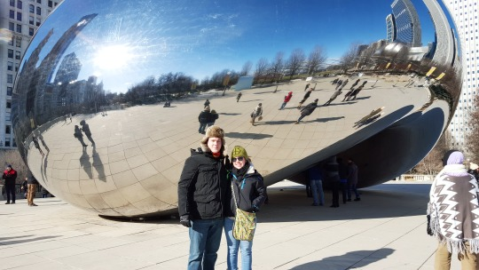
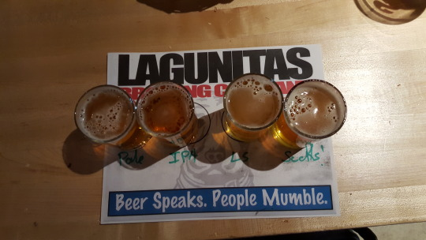
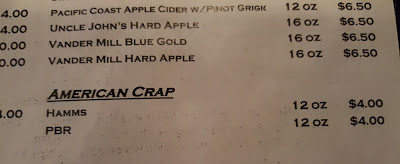
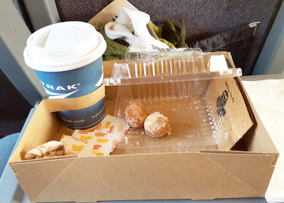
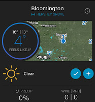
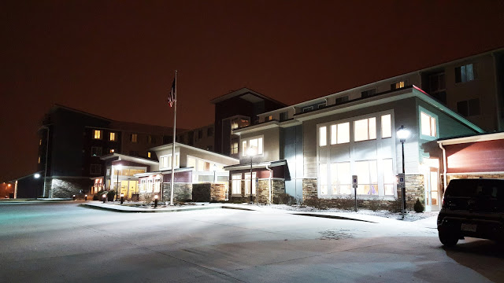
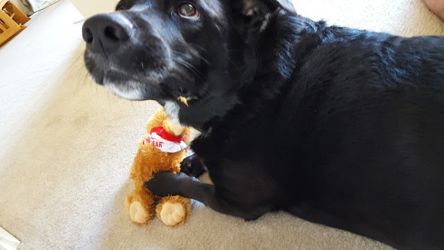

This past week has flown by! A week ago at this time I was at the [Haymarket Pub & Brewery](http://www.haymarketbrewing.com/) with Shaun in Chicago!  Now I'm back home, trying to warm my toes under my dog Mac. Here's what went down this past week:

Shaun and I went to Chicago for the 1st time! It was insanely cold and windy (of course). But we loved every second of it. I definitely want to go back!

Last Sunday we hit up [Lagunitas](https://lagunitas.com/). Um coolest brewery ever. We tried every beer we could (teamwork). Then we went to Haymarket, where we had more awesome beer. Then we got a [Lyft](https://www.lyft.com/invited/KALEIGH808390) back to the hotel, took off a thousand layers of clothes and went down to the hotel bar and got more beer. Sense a theme with us?

Eventually we went to bed, and then woke up crazy early to catch the train from Chicago to Bloomington.

Hungover breakfast of champions right there. Once we arrived (late) we scrambled to get to the airport to pick up the rental car, then checked into the hotel, had lunch, and Shaun dropped me off at work. Yep, that's right, my very first business trip (_they grow up so fast_).

After work, I was tired, and kind of glad I didn't pack workout gear because I wasn't feeling it. Shaun on the other hand had looked up jiu jitsu gyms and we went to check one out. He had a good practice and then we had some normal food for dinner - Moe's Monday. I even got a whole wheat burrito. I was crazy! Then we went back to the hotel, and I fell asleep BEFORE 9:30PM. #OldLady

Tuesday was cold, but warmer. WEIRD. After work, we went to a huge package store and made a 6 pack of beers we've never heard of. Then Shaun went to another jiu jitsu practice while I went to happy hour with my entire project team. That was fun. It was my 1st time drinking with coworkers (_again with the growing up stuff_). After I left, I missed karaoke, but I also didn't miss staying out past midnight. Because guess what....it snowed REAL SNOW!

Shaun and I were so excited like a bunch of 5 year olds. We were cheering for the snow plow and taking a billion pictures. I'm sure everyone thought we were idiots. It was so fun! Then I got back into that comfy bed at the Residence Inn. I need that bed. I hope when if I go back, I stay there again JUST for the bed. 5 Stars!

The next day seemed so quick, everyone left early to catch flights back to Atlanta. We were lucky and got a direct flight. I left work at 3 central time was home by 9pm my time. We were so excited to get home to see our puppy!

I bought Mac a bear from the company store and he loves it. He did make a few modifications but now he loves that thing more than his Moose! #DogMom

Thursday I _FINALLY_ got back to the gym, and then had to skip it Friday since I was short on time and everyone was scared of all the snow we were supposed to get. Nothing crazy happened. We watched Kingsman and Mrs. Doubtfire. Great movies. Saturday, we slept in, cleaned up our apartment, and went to my nephew's 4th birthday party! How is that kid 4??

Today, I woke up feeling great sick. My voice is going, and I have a burning cough. As of right now I *think* I'll be able to go to work tomorrow. But we'll see how the morning is. Luckily I have a job that allows me to work from home if needed (aka don't spread your germs), or take sick days. So we'll see what tomorrow brings. But I cannot wait to get back to the gym and do a bunch of kickboxing and TBF workouts. YOU HAVE NO IDEA. Or do you?!?

Anyways, this is part of the Weekly Wrap link up!

[HoHo Runs](http://hohoruns.blogspot.com/)

[MissSippiPiddlin](http://www.misssippipiddlin.com/)
