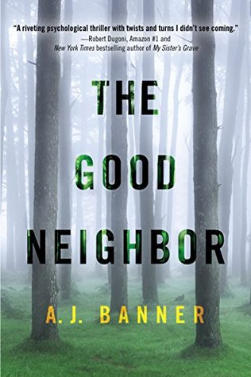

Happy Friday! Here are 5 things from this week I feel like sharing!! I've been sick all week so I didn't take any pictures of anything except for Mac!

1// [Chelsea Does](https://www.netflix.com/title/80073486) While I was checking out Netflix earlier this week, I noticed there was a new Chelsea Handler show on Netflix. I was curious since I have read a couple of her books in college and thought they were hilarious. This is actually a documentary (no not that making a murderer show!). It was really good..I watched all 4 episodes. Chelsea was very candid and asked all the questions about drugs, marriage, racism, and Silicon Valley, all while being funny and keeping things light while getting deep.

2// Lost 2 Pounds #2 is for me losing 2 pounds this week. I got on the scale this morning and was surprised to say the least. I haven't worked out in a week and I lose 2 pounds?? I know I've been sick, but I didn't think it did _that_ much damage. HEY I'm not complaining, I'm just surprised because for the past few months I have been going to the gym 4 times a week and the scale hasn't budged at all. Fingers crossed it doesn't go back up!

3// [The Good Neighbor](http://amzn.to/1nS9T39) I started reading this with my Kindle Unlimited subscription the other night and was immediately sucked in. I'm not done or anything, but I just wanted to give a shout out to a great book so far! Also, shout out to Kindle Unlimited. I got a free month (a month ago) and forgot to cancel it, but I'm not mad about it. I have been "checking out" books like crazy, taking a peek, or looking at travel books. It's fun stuff.

4//High School Reunion So today a friend from high school texted me that the planning for our 10 year high school reunion is underway. Um, what? It's not for another year, but still. That shiz is insane. I'm 98% sure I'm **not** going to go because 1. I only talk to a few people from high school so I don't need an official reunion to make me hang out with them and 2., just the Facebook group alone is a reunion enough. #StalkCity

5//Being Sick I've been sick all week! Sunday I wasn't feeling great and started losing my voice, Monday it was completely gone and I had a lovely cough, Tuesday I felt like crap and was uber congested. I took off of work and used [Teladoc](http://www.teladoc.com/) which is available to me through my insurance at work. I used the app to say hey, have a doctor call me. 2 minutes later a doctor called me and talked to me for maybe 3 minutes, and sent in a prescription for a z-pack and mucinex. BOOM. No driving/waiting rooms/people. All I had to do was go across the street to Target to get my meds. Wednesday I woke up feeling MUCH better and went into work. The meds are working but also messing with my stomach so I can't workout. I'm hoping by Saturday I'm much better so I can go to kickboxing!!

This post is part of a linkup with September Farm, [Eat Pray Run, DC](http://eatprayrundc.com/) and [Mar on the Run](http://www.marontherun.com/)
