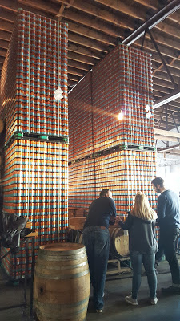
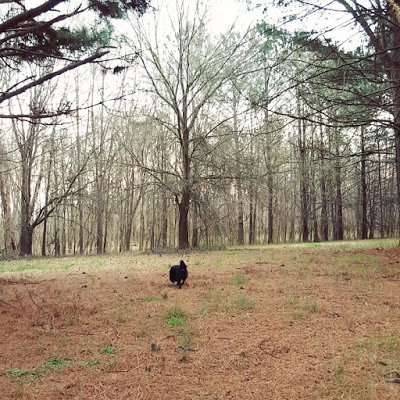

Hey February! Can you believe it, we're all done with January?? Crazy!

This past week flew by. I was out sick for most of it. I did go into work Weds-Friday, but still wasn't able to workout until Friday night.

I got some reading done, some blog stuff done, ya know. But this weekend was definitely the most exciting part. Saturday afternoon, we drove to Athens and went to [Creature Comforts](http://www.creaturecomfortsbeer.com/) brewery. It was really great. I love their beer Tropicalia, and was finally able to try their other stuff. I loved their Get Comfortable IPA and Koko Buni.

They were also having pet adoptions...it was SO HARD to say no to this one little guy named Jack (would go perfectly with Mac)! There's a weight limit of 60lbs at our apartment complex and Mac is uh, pushing that, so we definitely couldn't consider any pup there. Sad face for sure!!

Today we helped Shaun's grandma pack up for her move to a new place on Friday. When we got home, I got lunches for tomorrow going in the crock pot and the rice maker (lazy cooking, that's all I do!). And I finished getting together my TEA DRAWER! I love this...everything is together and in one easy to decide from place:

After that, Mac and I went to the field to run around:

And that's really about it...nothing crazy going on, just trying to feel better and taking it easy! I'm ready to get back into workout mode this week, that's for sure!

This was part of the Weekly Wrap link up! Check it out:

 

[HoHo Runs](http://hohoruns.blogspot.com/)

[MissSippiPiddlin](http://www.misssippipiddlin.com/)
