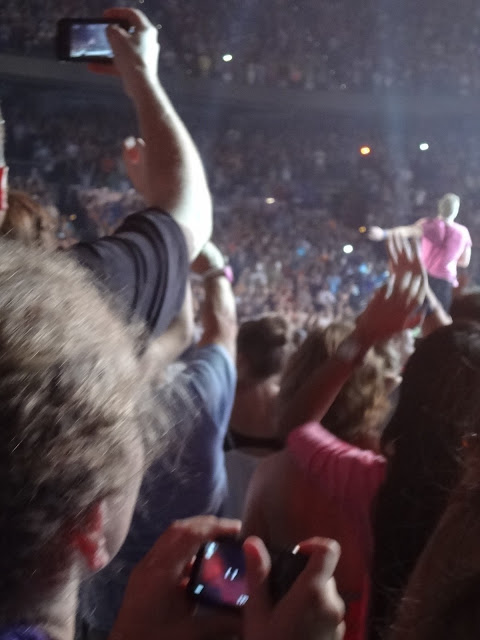

Hi, my name is Kaleigh and I love Coldplay.

On Easter 2003 (April 20th), the Easter bunny (hi Mom!) left a CD in my basket. It was A Rush Of Blood To The Head. Um..where was my Hilary Duff? Britney Spears? Nope. I knew of  Coldplay, I was loving their song Clocks at the moment (woo rock piano). But that didn't mean I wanted a whole CD!

I told myself to grow up, and branch out a little. So I opened it. And never stopped playing that exact CD until I got a car without a CD player in June.

If you can't do math, it's been almost 13 years of being a Coldplay fan. 5 albums, and 9 concerts later, here I am. Full of anxiety and needing to buy tickets. 2 weeks ago they announced US shows (FINALLY), and Atlanta was not on the list. After some careful re-reading, I learned that they'll most likely announce more...later. But I'm nervous and dying to see my boys. Their Ghost Stories tour was short. On big tours they always come to Atlanta, so I'm 98% sure they'll stop here again. BUT WHAT IF THEY DON'T?

So I need to buy tickets for an out of town show. But the pre-sale sucked, and now I'm screwed.

Dallas would be the cheapest place to fly to. Philadelphia is next on the list. Then it just gets expensive. But all the tickets that show up suck. Especially for coming in from out of town. I don't want to sit in the nosebleeds!

In summer 2005, I stood in line at the Ticketmaster counter at Publix to get tickets when they went on sale. I was #1 in line. Then another guy showed up. Then another. Because of dumb rules, we had to draw numbers and I was #3. The guy who came 3rd was #1 and the #2 guy switched with me because he's nice. I got seats that were on bleachers on the floor. I was a little pissed...until Chris Martin jumped off the stage and ran to my section. He was 5 feet away from me, and I somehow jumped up onto the back of the seat in front of me and was standing there going nuts (my mom was holding me up, haha). I also cried the 1st time they walked on stage at my 1st concert. LIKE A BABY. I'm so cool.

Out of the 9 concerts I've gone to, I've volunteered with [Oxfam](http://www.oxfamamerica.org/) at 4 of them. I have even been a team coordinator a few times.

It's a ton of fun, and gives me something productive to do while I'm waiting for the concert to start.

I just love Coldplay. I have a ton of merchandise, magazines, calendars, posters, and of course all the CD's. I learn their songs on the piano and violin. They keep me going and their music has gotten me through anything and everything that happens between being 14 -27 and beyond. I tried to see if I could meet anyone at their studio when I studied in London. I even walked down the aisle to Yellow at my wedding!

So, what I'm saying is...being in so deep with Coldplay, and having anxiety in general, I'm just a hot mess. Part of me is like, yeah spend $785 on a floor seat ticket (when I'm super short). The other part is like UM HOW MUCH? Because what if I can't see? What if I can't eat for a month? You know...

All fingers are crossed they announce some closer shows. I'm no stranger to traveling out of state (I've gone to Nashville, Birmingham, Charlotte, and almost got on a plane to Tampa but that one was cancelled). So if you're reading Coldplay, you're making this girl SUPER nervous!

_am I the only person who gets like this?_

_Do you like Coldplay too? If so we're already BFFs!_
