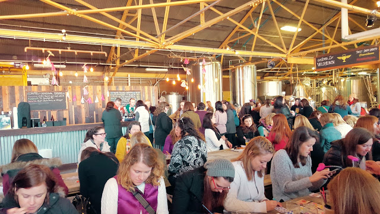

In case you didn't know, February 13th is Galentine's Day!! If you don't know what that is read about it here. But basically it's ladies celebrating ladies eating the best meal ever, brunch (aka waffles).  It's from [Parks & Recreation](http://www.hulu.com/parks-and-recreation). If you haven't seen that show yet...get on it!

[Wild Heaven](http://wildheavencraftbeers.com/), a craft brewery in Atlanta put on their own [Galentine's Day Brunch](https://www.facebook.com/events/541354012690138/). When I first found out about it I knew I was going. Beer + Crafts + Waffles? YES PLEASE. I went with my galentine Allie, and we were both insanely pumped! Luckily we bought tickets ahead of time because they sold out 2 weeks before the event!

When we arrived, we were given our souvenir glass with 4 tickets for beer, a stack of cards to color, and a coupon for waffles from the food truck, [Nana G's.](http://nanagchik-n-waffles.com/) We got right to work and grabbed some craft supplies and got our 1st beers. I was super lucky enough to get the last glass of their Blackberry Wild Ale! So good! We watched a bit of Legally Blonde while we chatted, and then got refills. I got an Emergency Drinking Beer mimosa! Game changer!

Then it was time for waffles! I got just a classic waffle (only later realizing I didn't pick the one with chicken! Whoops!) But it was so good. Who doesn't love a good waffle??

Next, it was time for some coloring!

Wild Heaven gave us such awesome Galentine's Day/Beer themed coloring cards! These aren't even all of them! They had colored pencils, glitter, stickers, all sorts of stuff to decorate the cards with. I mostly stuck to the colored pencils but I did break out the glitter for one of the cards.

This was such a fun event! It was my 1st time visiting Wild Heaven, and I will definitely be going back. When they opened the doors at 2pm, I saw that they serve flights, and I'm a fan of flights. I'll be back to try more of their beer! You can check out more Galentine's Day pics on their [Facebook page](https://www.facebook.com/media/set/?set=a.1068677526504575.1073741832.128692393836431&type=3), [Instagram](https://www.instagram.com/beerwildheaven/), and [my Instagram](https://www.instagram.com/klgh.js/)!

I am already counting down the days until next year's Galentine's Day! (362 days, in case you were wondering)
