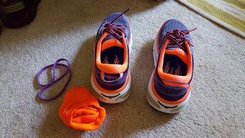

This is a weird post to write. At 1st you might think I'm either lazy or injured. I am indeed injured.

But, when I 1st thought of this post idea I knew I had some pains and thought that if I just took some time off, let my body reset and then go hard again, all would be well.

WELL!

2015 was a little tough for me + triathlons. I was only able to do 1 tri in 2014 due to my thumb injury, so I wanted 2015 to be great and full of triathlons, PR's, and overall awesomeness. Somewhere around the spring time, my right foot started hurting. I didn't think much of it (thought it was plantar fasciitis coming back), and continued with my training. The pain grew and lasted for longer periods of time (aka days after a workout). I wrapped my foot and even got a special sock for my foot to wear at night. Super cute.

I did the retro triathlon at the beginning of June and it was great and a crazy hard course. I got 2nd in my age group and was feeling excited. Somewhere between this tri and the one at the end of June, my  right hip started hurting. After the Allatoona tri, I got stretched out by a PT and it was amazing and also alerted me that I needed to watch it.

Fast forward to the beginning of August. Most of July we were gone in Europe, so I wasn't able to train at all for my 3rd triathlon. So I didn't go. Sad face. But I knew I didn't want to hurt myself further.

I started a 5k training plan for a race in October. I ran 5-6 times a week. My foot hurt, my hip hurt, and my shins too. I used some KT Tape, wrapped my foot, and took the pain as a sign of accomplishment.

After the 5k I wanted to focus on getting stronger, try for a 6-pack, and get toned. No races, just results. After the gym (burpees, box jumps, lunges) my foot would be killer. I didn't want to sound like a baby. Walking sucked, just sitting at my desk at work hurt, turning my foot certain ways hurt, and I stopped using my standing desk so much.

Finally on February 4th, I went to PT Solutions for their free injury screening. I told the guy I was totally prepared to take time off and fix this problem. So he referred me to a podiatrist. I visited one last week thinking it wasn't too big of a deal. She took some x-rays, and when she 1st came into the room, she took both of my feet, pressed on the inside and I think I jumped 3 feet off the table. OW!!!1!!!!

She had a look that was like "damn". She wanted to torture me feel a few more places before telling me what the problem was. I've torn some tendons and ligaments and the bones in my foot are just hanging out. Google "lisfranc double joint fracture" if you're interested. I had a CT scan yesterday, today I have a follow up to see what the CT scan revealed, and a 2nd opinion on Friday.

But basically, I have REALLY messed up my foot. Worst case scenario is that I have surgery and am non weight bearing for THREE MONTHS. So fingers and toes are crossed that's not the case.

So that is why I'm now taking this year off from triathlons and running. I hope I can still bike. I will still focus on what I can and abs. I'm just really upset about this since I love working out and hate being told I can't do something. The only good part about this is that I'm not in it alone. Shaun is also out of order. He hurt his back and has a doctor's appointment for Monday. So we both can't workout and do what we really love.

<iframe src="//giphy.com/embed/Vl1cAmkOrlB2E" width="480" height="310" frameborder="0" allowfullscreen="allowfullscreen"></iframe>

I don't know how to close this other than asking for suggestions on workouts and things to watch on Netflix. Hopefully later today I'll have somewhat okay news to share...
