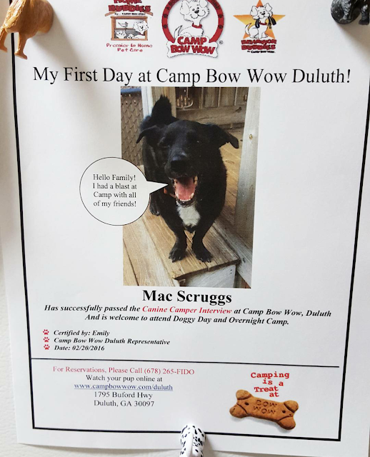
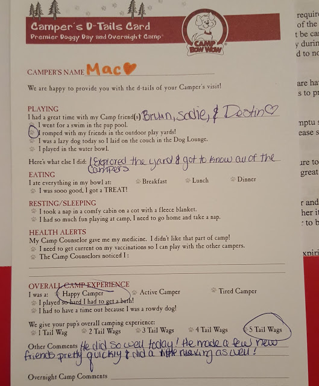

It has been a hot minute since I did a Weekly Wrap! This month has been a tad crazy. I'm participating in a [Grow Your Blog Blog Hop](http://runawaybridalplanner.blogspot.com/2016/02/blogger-meet-up-grow-your-blog.html) with [Kristy at Runaway Bridal Planner](http://runawaybridalplanner.blogspot.com/), and this is the week that my blog is featured! So if you're checking me out, welcome! I'll be doing a more in-depth about me post tomorrow!

Last week seemed to fly by but slowly...if that makes sense. I went out to lunch with coworkers on Monday to Shane's Rib Shack and ate a healthy kids meal.

Tuesday I had my CT scan, and went to happy hour with my coworkers. Slowly but surely I'm making friends with coworkers outside of work.

Wednesday there was an Atlanta Women in Technology breakfast, and a bunch of us from work went. It was so helpful and tasty!

I went to work for a few hours, then left for my follow up at my original foot doctor. She viewed my CT scan, and said even though the CT quality was crappy, she could tell it was a bad fracture and I could wear a boot and not put any weight on my foot for 6-8 weeks and then do PT. Or I could do surgery and go that route. She also said I'd have to have surgery a year later to remove the screw she'd put in, putting me at no running for at least a year. I left saying I'd try the boot 1st, think about surgery, and in a shitty mood. So I stopped by Juice Bar _finally._ They let me try a few, and I settled on a root juice called Orange You Glad with carrot, apple, pineapple, lemon, ginger and mint in it. It was really good!

Thursday, nothing crazy happened except for some grocery shopping, ab work, and reading.

Friday I was feeling kinda crappy because of my foot (see this post for more info), but I had an appointment with another doctor. The doctor I went to (the same office that took care of my thumb), was super awesome. He took new x-rays and viewed my CT scan. He couldn't find anything that led him to believe I had a lisfranc injury. He said if I had one, I wouldn't be able to handle walking on it. He did say though that I had [tibialis anterior tendonitis](http://www.physioadvisor.com.au/8183750/tibialis-anterior-tendonitis-tibialis-anterior-t.htm). Which does make more sense. It's basically the tendon that's attached to your inner foot by the arch and travels around your shin up your calf. \*ding ding\*. That would explain the foot pain, heel tightness (because my calf is tight), and my shin pain. He gave me a prescription for some heavy duty anti-inflammatory, stretches to do, and I'll check back with him in a month.

I am also going to FINALLY buy new workout shoes (I have Hokas for running only), and get the Superfeet insoles. Suggestions??

SUCH HAPPY!

Saturday, I did a circuit workout at our gym, and then Shaun and I took Mac to Camp Bow Wow for an interview. He has to do it in order to do the day or overnight camps there. I looked into it because we want to get him some training for when he's on his leash. He gets into a zone where he doesn't listen (especially with me), and sometimes he might scare other people if he wants to go up to them and sniff and isn't listening to my commands to stop and not pull.

We watched as they introduced him to dogs there and he did great! They have them stay for at least 3 hours to see how he does and we could watch on their webcams. It sounds like in general it will be great to get him out of the house during the day and they'll train him while he's there! Plus we'll probably do group classes as well. When we picked him up, they gave us a report card and a picture they took of him! I LOVED IT SO MUCH! I HAVE TO SHOW YOU:

Now you know I'm a crazy dog parent....and yes, those are [dog butt magnets](http://amzn.to/21jaysN)! Shaun jokingly said we can't do it because all I'll do at work is watch the webcam and not get any work done. I said no, I have 3 monitors so I'll be watching *while* I work!

And that's about it...Sunday was a lazy rainy Sunday, and I tried out our new [Tens Unit](http://amzn.to/1VxECgT) on my calves and tendon.

This was part of the Weekly Wrap link up! Check it out, it's a great way to meet bloggers and find new blogs to follow!

[HoHo Runs](http://hohoruns.blogspot.com/)

[MissSippiPiddlin](http://www.misssippipiddlin.com/)
