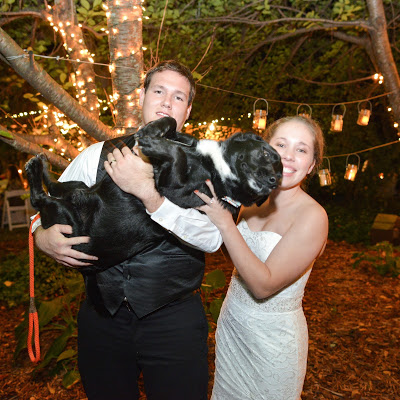
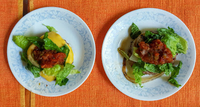

Hello, Blog World! I'm participating in the [Grow Your Blog Blog Hop](http://runawaybridalplanner.blogspot.com/2016/02/blogger-meet-up-grow-your-blog.html) with [Kristy at Runaway Bridal Planner](http://runawaybridalplanner.blogspot.com/), and this is the week that my blog is featured! So if you're here because of that, welcome! If not, welcome!

Chances are, you've seen my About page. If not, you can check it out. This is my 1 millionth blog. Not really, but probably close to it. I have been blogging on and off since I graduated from Georgia Southern in 2012. I started as Code Bike Run, which is now my Tumblr page, so if you're into that, follow me there. I started and stopped under that name so many times, and then tried others. [Kaleigh Codes](https://twitter.com/kaleighcodes) was actually my Twitter handle for a long time (still is), and I was like, why not that one?

SO I've been trying this now for a few months. Blogging is interesting, especially how much it's evolved in the past few years. I just love connecting and talking with other people. I love the power of the internet! I want to share fitness and healthy eating, triathlons, running, technology, and life in general.

So, about _me_...or what you might be interested to know:

I have done about 9 triathlons. I was a XC runner in high school, continued running in college, and then figured out what a triathlon was. I rode my bike everywhere while at GA Southern. Mostly because I didn't have a car for a while, and also because it was much faster than walking and I loved to ride. I upgraded from my too small girls bike, to a hybrid, then got a vintage road bike. After fighting with that for a couple years, I invested in a Fuji women's road bike. Running started becoming my least favorite as I began to get shin splints in 2012. I went to PT, but am weary of them coming back.

Trying to do grad school, triathlons, and work was tough, but somehow I did it. I graduated with a Masters of Internet Technology from UGA in 2014. 2014 was a crazy crazy year. First, I was laid off, then moved out of my parent's house, broke my thumb (required 3 surgeries, pins, and anchoring my tendon back to the bone), graduated, worked a terrible job, planned a wedding & got married, accepted an offer for my current job.

In 2015 I started my new job as a Java (software) developer, moved into our current apartment, and figured out the hard way I have wheat-dependent, exercise-induced anaphylaxis. Fancy for don't eat gluten and then go for a run or you'll die. After that, I realized I needed to get my life together in terms of food. My husband and I both did the Virgin diet to cleanse and heal ourselves, and slowly added back in the 'bad' foods. Since then we have been eating a lot cleaner and overall feel better. I was not aware my stomach wasn't supposed to kill me every single day!

Now I mostly avoid gluten, dairy, soy, and sugar. Of course I do cheat and get caught in a bad week of Chinese take out, free pizza at work, and donuts. BUT I do know how to manage it all now.

I think we're up to speed now. You can read about how I have tibialis anterior tendonitis here and here. My goal right now is to get more defined abs, arms, and be as healthy as I can be. Luckily my foot doctor gave me some awesome anti-inflammatory and my foot is much better this week, so I'm back to working out slowly. We're going on a cruise soon and I'd like to feel good about being in my bathing suit, you know? Even though this blog is still new, I'll be posting healthy recipes (aka healthy cookies), cool at-home workouts, reviews, and try to translate anything technology related for everyone to understand.

So now we're friends, and welcome to my blog!
