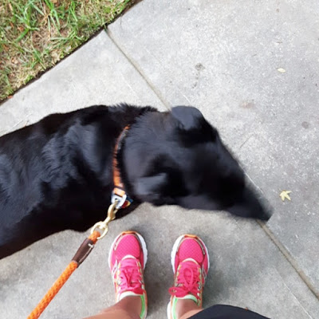

I feel a little silly writing a "Workout Wednesday" post today because I definitely did not work out today. This week has been crazy! This post is a fun look back on my past week's workouts:

**Thursday** A Cyclebar has finally opened near me! This one is right down the street from my office, so when I found out they were doing FREE rides, I signed up! The only one that would work with my work schedule was their 5:30am ride. OUCH! I missed the 1st minute of the class because I was getting my shoes on, but it was really cool! The facility was super nice, and so were the people. The ride was a little tough, but I loved it. I haven't spinned in a LONG time!

After the class they send you your stats!

Sweet! I grabbed my complimentary banana, and headed to the gym at work to shower! Now I'm doing this again tomorrow! EEEK

...and then, because I'm crazy, I did Total Body Fitness Thursday night! MY LEGS WERE DEAD AND I NEEDED SLEEP. But it was fun! **Friday** I did a chill elliptical workout at the apartment gym for 40 minutes.

**Saturday** Kickboxing! My arms were dead, and so were my legs!

**Monday** Kickboxing and TBF. TBF was outside, and it was H-O-T. We did everything, including monkey bars. It killed my hands, but it was a little bit fun. Now I'm sore in places I didn't know had muscle.

**Tuesday** Kickboxing! So.much.sweat. Still sore! I was supposed to do a 5:30am Cyclebar class...but I opted out when my alarm went off. NOPE.

**Wednesday** A much needed rest day. I did do a lot of walking since I had to go downtown to the aquarium for a volunteer meeting!

 

Now, it's time for bed. Cyclebar in the morning!

_Have you ever been to a Cyclebar?_ 

_Do you wake up before the sun comes up to workout??_

Follow me on [Twitter](https://twitter.com/kaleighcodes) and [Instagram](https://www.instagram.com/codebikerun/) to see if I actually go tomorrow! :)
