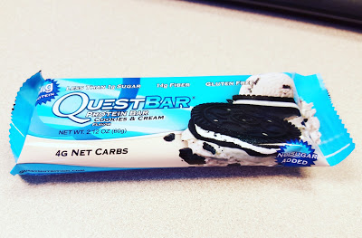

This week has flown by! Not only outside of work, but at work as well. Obviously it's a good thing when work goes by quick, but if I don't make time to eat breakfast when I first get in, it could be hours after I arrive (and I could be hangry!)

I wanted to show you guys what my favorite quick and easy breakfasts are when you're running out the door, or don't have many resources at work!

pictured: Mighty Muffin & Oatmeal

//Mighty Muffin// Alex at [Power Clean Eats](http://www.powercleaneats.com/) got me interested in [Mighty Muffin](http://www.flapjacked.com/collections/mighty-muffins). Her pictures of them looked so good, and it just sounded interesting in general! The only place I can find them are in the 'organic/healthy' section of Kroger near the oatmeal. They're a little over $3 each, but definitely worth it. They're gluten free, high in fiber and protein, and easy to make! Just add water and pop into the microwave!

//Oatmeal// I'm into Trader Joe’s Maple & Brown Sugar Instant Oatmeal right now. $2.49 for 10 packets...that's 2 weeks of breakfasts at work! I used to hate oatmeal, but was always interested in it (sounds weird), so about once a year I'd try it to check. This year, I tried it at a Residence Inn and WAS IN LOVE. They had a make your own oatmeal bar and I added the brown sugar, and that was that! The only tricky thing about making oatmeal is that you have to watch it so it doesn't spill all over the microwave!

//Quest Bar//

I haven't had these in a while since finding the S'more's Luna bars, but Quest Bars are great! I usually keep one in my purse or backpack, and they are great for when you have 0 time but are starving. They have a lot of protein and fill you up quick! Plus Trader Joe's has the best deal on them I've seen!

//Luna Bar// I'm sad I don't have a pic of Luna Bars, but they are amazing. There are a ton of flavors. Some are gluten free and some are not, but all seem to have a lot of protein. I love to eat these either for breakfast with some juice, or as a afternoon snack.

//Banana// Pretty self explanatory, but I feel like I can't go wrong with bananas. One of the few foods I feel comfortable eating before a workout (more on why later), plus they have a ton of potassium. #GoodForYou

what's your favorite quick breakfast? do you eat before you go to work or at work?

Follow me on [Twitter](https://twitter.com/kaleighcodes) and [Instagram](https://www.instagram.com/codebikerun/)! And don't forget [Bloglovin'](https://www.bloglovin.com/blogs/codebikerun-12713491)!

 

This is a Friday Five link up with [You Signed Up For WHAT?!](http://www.yousignedupforwhat.com/), [Mar on the Run](http://marontherun.com/), & [Eat Pray Run, DC](http://eatprayrundc.com/).

