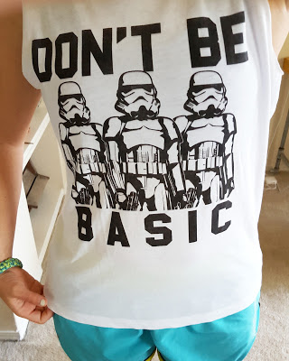
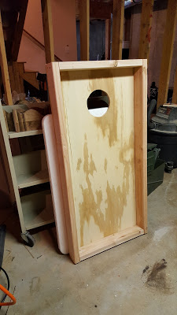

**Thursday** I started out bright and early by going to a 5:30am class at the Cyclebar! When I arrived most people were inside already, so as I was getting my shoes on, they told me to go to a different bike, someone was already in mine. Um okay. I did, and then the screen on my side wasn't working so I couldn't see my stats the whole time. Once we got our results back I thought they looked like I did more than I really did (but I was watching the guy who was in my bike, and he was going super slow). I asked the front desk, but they said it was fine.

After work, Shaun and I went to our gym and we did our total body fitness class. It was outside and it was HOT! But it was a good workout though! My hands are super sore from the monkey bars! **Friday** I did the elliptical at our apartment gym after work again for about 40 minutes. Fridays are always crazy, but I was able to fit it in! I got off work super early, but had a bunch of errands to run and things to buy at Target. (see shirt below). **Saturday** I did kickboxing in the morning. It was a really good workout, and I wore my new tank:

find it here

After we got home, we took Mac out to run around in the woods and go for a swim in the river. Afterwards I was so tired! We hung out at the pool and then got dinner and watched a movie before I fell asleep on the couch. We stopped the movie to see the [Space Station fly by](https://spotthestation.nasa.gov/) though! **Sunday** Nada. Shaun and I started building our own cornhole game though! We're almost done!

**Monday** I had planned to workout on Memorial Day, and then we had decided to go kayaking in the early afternoon. But when Shaun drove by the river and saw that everyone and their mom was out, we decided to just go to the pool instead. Kayaking was supposed to be my workout, so I missed out on that. **Tuesday** It's Tuesday already! I was planning on going to kickboxing, but Shaun hasn't been feeling well, so I stayed home to get some grocery shopping done and did the elliptical at our gym again. **Wednesday** Plans are to go to kickboxing!! I hope my doctor's appointment after work doesn't take long, otherwise I might miss it!!

What were your workouts?

Do you want to be FitBit friends? Let me know!!

follow me on [Twitter](https://twitter.com/kaleighcodes) and [Instagram](https://www.instagram.com/codebikerun/)!

view previous Workout Wednesday posts here
