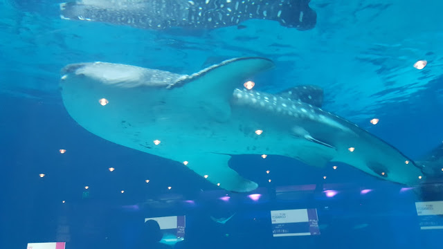
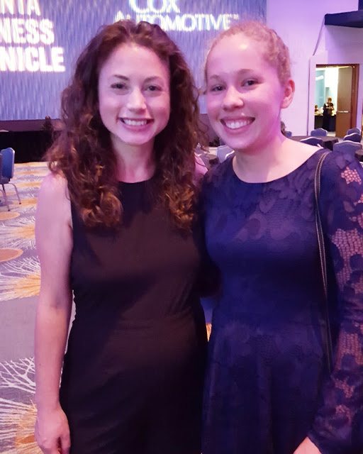
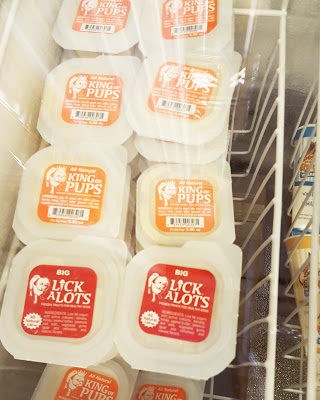
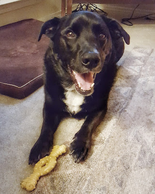

I have not done a weekly wrap in a LONG time! No excuse!

**Monday-Memorial Day** Can you say pool? We wanted to go kayaking but there were a ton of people tubing on the river so we decided against it. Sometimes when there are a bunch of tubers, they ask us to tow them, where they get out at (no idea what trip you paid for, sorry), or get our dog all crazy. Not that we don't like to help people, but we also like to relax on the river as well.

**Tuesday** Back to work, but it's a 4 day work week. Can't complain too much. I had a nonstop day at work, and was going to go to the gym afterwards but decided against it since Shaun wasn't feeling well and I needed to take care of him #wife. I went to our apartment gym and did the elliptical and caught up on the Mindy Project.

**Wednesday** Another crazy day at work, plus a doctor's appointment that took forever mixed with getting out at prime traffic time meant no gym again. Back to the elliptical!

**Thursday** Jam packed day at work again (sensing a pattern?), plus I got to leave early because I was volunteering with Atlanta Women in Technology for their WIT Connect event at the aquarium! I made it there in record time, and was able to chill before I started volunteering. The event was in the ballroom which has 2 views of 2 different tanks:

 

It's hard to take good pictures at aquariums!

I worked a registration table for a few hours, and then was able to go into the event to eat, and listen to the speakers. They gave 4 scholarships to young girls doing awesome things in STEM, and then had Debbie Sterling, the inventor and CEO of [GoldieBlox](http://www.goldieblox.com/) speak. She did a great job and I was hoping to meet her! I had to go back and work a checkout table, but once I was done, I went to wait in line to talk to her.

I had NO idea what I was going to say, but I told her I thought GoldieBlox was great and thanked her for her speech. We joked about how we look young because she asked if I was still in school! Fun times!!

**Friday** I was very tired Friday...I didn't get home until 10:30 the night before, but Friday seemed to fly by. I had some errands to do after work, and then I did the elliptical AGAIN. But I finally bought the 4th season of [Orphan Black on Amazon](https://www.amazon.com/The-Collapse-of-Nature/dp/B01D5J0IT0/ref=sr_1_1/ref=sr_1_1?_encoding=UTF8&keywords=orphan%20black%20season%204&qid=1465219804&sr=8-1), so I watched an episode, I'm definitely not caught up! Later, I made some gluten-free muffins, and we watched the Office on Netflix.

Also, I went to Tin Drum for lunch and it was amazing! I looked up what their gluten free options were, and got sweet & sour stir fry:

**Saturday** Shaun and I got up, and went to the gym. While he was in his class, I went to charge my car and get us lunch. I found out something awesome with my car - at fast chargers it automatically shuts off at 83%, but if I turn it back on, I can get my car to 94%!!!! Game changer!! I was pretty excited about it...

I also bought Mac a ham bone from a pet store, and saw these...like King of Pops, but for dogs:

I didn't buy him any, but I think I'll go back soon and get him one!

Shaun and I took an afternoon nap because I was going to have to be up at 1AM for a deploy for work. Luckily they don't make us go into the office, because I wouldn't be going into an empty building by myself in the middle of the night! It actually didn't take that long and I was about to sign off around 3am. (it was supposed to go until 7am!).

**Sunday** We definitely slept in, and wanted to kayak, but, it was raining. Shaun's stomach was killing him and I had to run out to the store to buy some medicine for him. And then I ran out again to give the guy who used to live in our apartment his car tags! I used internet detective skills to track him down, I didn't want to do return to sender on it since I could tell what it was. The rest of the night I spent learning how to make Blogger templates (oh yea! coming to you SOON!) and watching The Office. Waiting on Jim and Pam to get together!!!

Join the Weekly Wrap with [Hoho Runs](https://hohoruns.blogspot.com/) and [MissSippiPiddlin](http://www.misssippipiddlin.com/)!

Have a great week!

Did you do anything fun this past weekend??

Connect with me:

[Instagram](https://www.instagram.com/codebikerun/)

[Twitter](https://twitter.com/kaleighcodes)

Pinterest

[Bloglovin](https://www.bloglovin.com/blogs/codebikerun-12713491)
