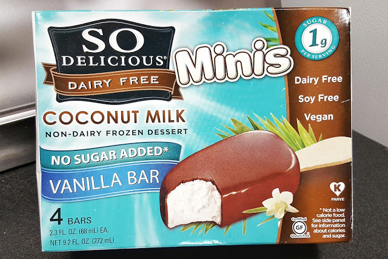
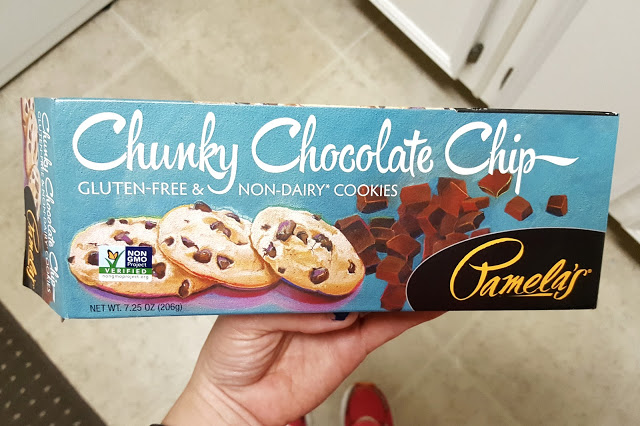
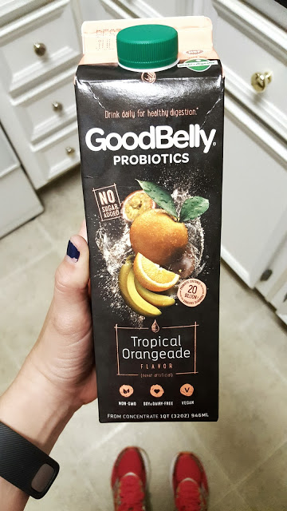
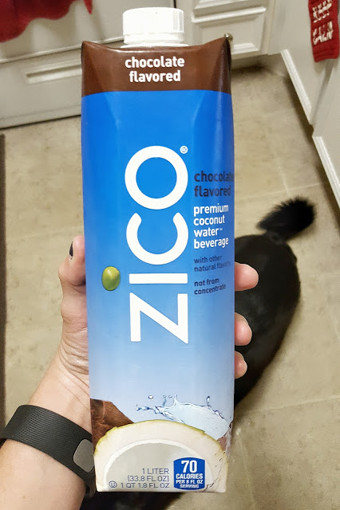
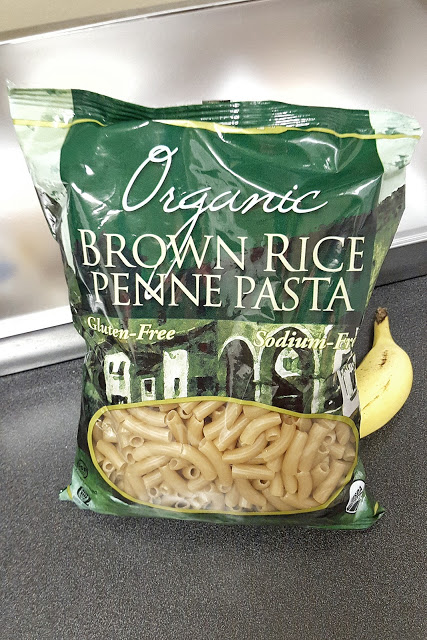

Happy Friday!! I wanted to share with you all my favorite gluten free and dairy free finds lately. For the past 3 weeks Shaun and I have cut out gluten, dairy, soy, and sugar. It's tough, but also worth it because we don't feel so crappy! I highly recommend it!

It's really hard to find food that doesn't have gluten AND dairy and still tastes good, so I wanted to share what I've found lately. Living by a Whole Foods, Trader Joe's, Sprouts and Earth Fare, I have no excuse to not find tasty gluten and dairy free foods!

//So Delicious Coconut milk, No Sugar Added, Vanilla Bar Minis// These bars are AMAZING. We got them last summer when we first went on the Virgin Diet, and they have been a lifesaver if you have a huge sweet tooth. They taste great (you only taste the coconut if you really think about it), and are mini, so they're not a huge commitment. I got them at Sprouts last night for $3.99 for 4 bars. Not bad!

//Pamela's Chunky Chocolate Chip Cookies// I discovered these last night at Sprouts and they didn't disappoint! I was nervous since they're gluten free cookies, but they are legit! They taste almost like shortbread cookies, and I would imagine goes great with some almond milk. These were $3.99 for the box. I posted these last night on Instagram and have #noshame that I ate one in the car on the way home from the store

//Good Belly Probiotic Tropical Orangeade// I have been looking for a probiotic without dairy, and [here is one!](http://goodbelly.com/by-the-glass/) This drink is super tasty, and good for you! Sold!

// Zico Chocolate Flavored Coconut Water// Um. Chocolate water. This stuff is amazing. Shaun and I are addicted to this. We had it last year at one of my triathlons and a couple of weeks ago Publix had a special on them so we bought 2. The special is no longer, but I don't care, I'll pay whatever for this chocolate goodness.

//Trader Joe's Organic Brown Rice Penne Pasta// We've [been making this](https://www.amazon.com/Trader-Joes-Organic-Brown-Pasta-16oz/dp/B008RLNQBO?ie=UTF8&*Version*=1&*entries*=0) for a month now, and it's really great. You wouldn't know it's gluten-free unless you read the package. I am not the cook in the family so I don't know what else to say, but that I eat it and love it.

[this post is part of the Friday Five](http://www.yousignedupforwhat.com/)

_Do you have any gluten free or dairy free favorites?_

_What's your favorite grocery store?_

[follow me on Instagram](https://www.instagram.com/codebikerun/) to see what sort of gluten-free shenanigans I get into!!
