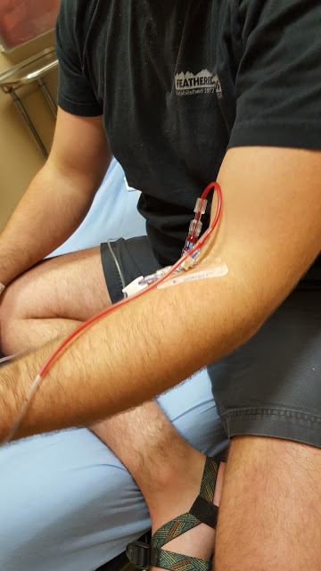

This past week has been crazy..again..is that normal?? I can't believe it's time to do it all again.

I made it to kickboxing and total body fitness on Monday and Thursday nights, Wednesday and Friday I did the elliptical in the gym and caught up on some shows. The rest of my week was all over the place.

Monday, I got to sleep in a little bit since I stayed up doing a deployment for work early Sunday morning. Shaun woke up in a lot of pain, so I made some calls to his doctor and was able to get him a lunch appointment for a gastroenterologist. I ran some errands, and then it was time to sign onto my meetings for work for a few hours.

Tuesday and Wednesday were going to be long days at work because we had all day planning sessions. When I was heading out to the allergist/lunch Shaun called me because he was in a lot of stomach pain. He called his aunt who is a nurse and she told him to go to the ER. Shaun's brother was able to take him and I headed straight there after work. They did a CT scan, blood work, and gave him fluids and medicine. Eventually he was feeling a bit better, and they sent us home with 3 prescriptions.

<table style="margin-left: auto; margin-right: auto; text-align: center;" cellspacing="0" cellpadding="0" align="center"><tbody><tr><td style="text-align: center;"></td></tr><tr><td style="text-align: center;">blood!</td></tr></tbody></table>

We don't know what exactly is wrong yet, but they mentioned gastritis in the ER, and that it's probably not an ulcer. Shaun has an endoscopy scheduled for _next_ week, and we're trying to see if he can get an ultrasound this weekend to rule out anything with his gallbladder. Such craziness. It feels like the doctors aren't really trying anything and aren't in any kind of rush, yet Shaun is in a ton of pain for most of the day. Even though we've cut out foods like gluten, sugar, and dairy, we're now reading every label even closer looking for no or low fat, no cholesterol, and just low everything in general. That seems to be helping, but he's definitely not living life normally and we'd love to go kayaking but either he's not feeling good, or I'm nervous he won't feel well once we're out there.

<table style="margin-left: auto; margin-right: auto; text-align: center;" cellspacing="0" cellpadding="0" align="center"><tbody><tr><td style="text-align: center;"></td></tr><tr><td style="text-align: center;">the Pink Drink!</td></tr></tbody></table>

if you follow me on Instagram, you'll [see I rewarded myself with a Pink Drink](https://www.instagram.com/codebikerun/)!

But anyways.....the rest of the week, I was able to get some workouts in, and Shaun was able to go to jiu-jitsu once he was on his new medicine. Friday we packed to stay the weekend in Dahlonega at Shaun's parent's mountain house. We left Saturday morning (and took my car), drove up, and did a bunch of work to the fire pit area. Shaun started feeling crappy again, so we left, charged my car a little bit in downtown Dahlonega, and then continued on home. We made it with 16 miles left! #DriveElectric

<table style="margin-left: auto; margin-right: auto; text-align: center;" cellspacing="0" cellpadding="0" align="center"><tbody><tr><td style="text-align: center;"></td></tr><tr><td style="text-align: center;">before/after</td></tr></tbody></table>

The rest of the night we watched The Office (we're now on season 5), and ate a small dinner. Sunday, we got up, went shopping at Target, Publix and Whole Foods, and found some food Shaun should be able to tolerate. Then we went to the pool! It rained a little bit, but we were still able to get some sun and hang out in the water.

<table style="margin-left: auto; margin-right: auto; text-align: center;" cellspacing="0" cellpadding="0" align="center"><tbody><tr><td style="text-align: center;"></td></tr><tr><td style="text-align: center;">YAAS DONUT</td></tr></tbody></table>

Shaun made some awesome chicken and shrimp (for him) tacos for dinner, and then we, you guessed it, watched The Office until it was time for bed! I'm hoping this week will be a bit smoother, and have a lot more workouts in it!

Did you do anything fun this past weekend??

Join the Weekly Wrap with [Hoho Runs](https://hohoruns.blogspot.com/) and [MissSippiPiddlin](http://www.misssippipiddlin.com/)!

Connect with me:

[Instagram](https://www.instagram.com/codebikerun/)

[Twitter](https://twitter.com/kaleighcodes)

Pinterest

[Bloglovin](https://www.bloglovin.com/blogs/codebikerun-12713491)

 

posts last week:

weekly wrap

favorite travel apps

5 great gluten and dairy free finds
