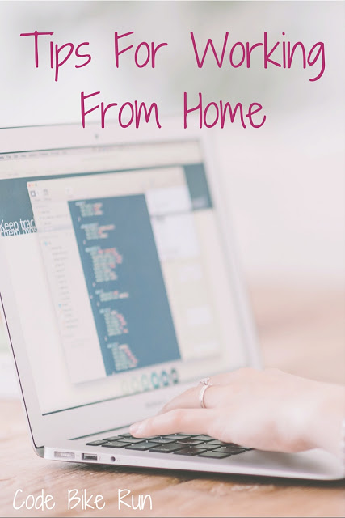

Ah yes...working from home (or WFH as we like to call it at work). People who aren't able to work from home think it's all fun and games. If you call worrying your coworkers are thinking you're slacking fun, and actual work games, then you're right.

I am lucky enough to work for a company and in an industry that allows me to do my job from pretty much anywhere. As long as there's wifi and electricity...I'm good to go. I can't just wake up any day and say WFH! but in the case like yesterday, where I had a terrible cough and lost my voice, I was able to email my manager to ask if I could work from home.

You _need_ to have rules and structure to your day, just like any other day. Here's what I do when I work from home in order to still function like a normal person.

**Wake Up**

Yeah, like actually wake up at a normal hour. On a normal day I get up 30 mins before I'm supposed to leave for work. That means I'm up an hour before I start work on a WFH day. Either I will get started early so I am done earlier, or take my sweet time and browse Instagram and Facebook before moving.

**Take A Shower and Get Dressed**

You don't have to wear actual work clothes, but you need to change clothes. Yesterday I wore yoga pants and a sweatshirt. But that's not what I slept in. I also took the extra time to wash my hair in the morning for once.

**Morning Duties**

In the morning, I usually take Mac outside while Shaun is getting ready for work. So when I get out of bed on weekdays, Mac thinks I'm about to take him out. This can be annoying because I'm not always dressed for anyone to see me when I roll out of bed. Wait a minute dog!

I also make tea and breakfast when I'm working from home. Yesterday I didn't really eat any breakfast since we didn't have any food I wasn't feeling too great. But you know I made some nice tea!

**Get Your Workspace Set Up**

When I work from home, it's so easy to hang out on the couch and work. Which is what I usually do in the afternoon. But for the 1st half of the day, I get my laptop, mouse and headset set up at our dining room table. I like sitting there and we get a lot of the morning sun in the dining room so it's a nice change to be out of fluorescent lights during the waking hours.

**Be Active At Work**

Just because you're not physically at work doesn't mean you need to act like you're not "there" altogether. When I'm in meetings I turn on my video (after finding the perfect light/angle), IM my teammates any and all my questions, and make sure the volume on my laptop is turned up so I can hear the incoming IM or email notifications.

**Go Out For Lunch**

Since I've been home all morning and got to miss out on that morning traffic, I like to pick up lunch somewhere. Yesterday, since I had lost my voice, I ordered food online and then picked it up. I also like to go places I can't go to at work. I also take Mac with me for a ride so he can get out and stretch his little legs too.

**Don't Tell Everyone You're Home**

I mean this in a nice way. My husband knows I'm home, but that's about it. If I tell my parents or friends also not at work, they'll try to hang out. I treat it like any other workday. Also, since you don't have anyone else around, don't take this time to post a million things on your social media...especially if you're friends with coworkers on it. It will look like you're not working....because you're not.

**No Distractions**

AKA no Netflix/Hulu/Amazon catch ups. If you can't do it in the office, don't do it at home. Sure for lunch I might watch a 30 minute show, but that's it. Music only.

Boom, there you go...that's how I get through working from home. Don't abuse the privilege!

_do you ever work from home?_

Follow me on Pinterest to see more work and professional tips!
