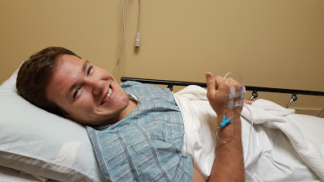
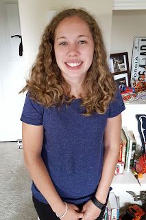
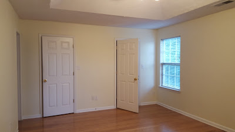
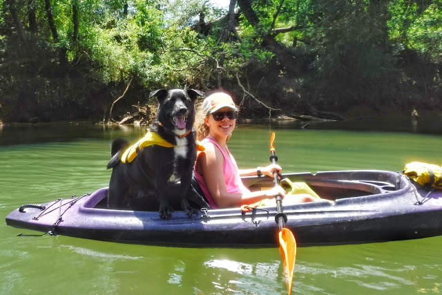
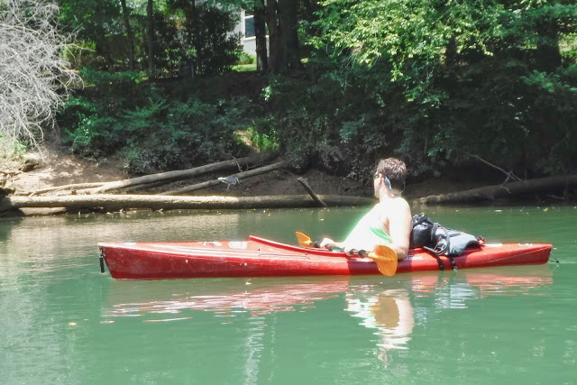

It's Tuesday night, and I'm about to stay up until who knows when. I have to do a deploy in the middle of the night for work (again), and had originally thought it was going to be during the day Wednesday. But this morning I learned it wasn't. So I'll be awake for about 24 hours. CAN'T WAIT.

So, lets back up to last Monday. I posted my Weekly Wrap about the previous week, mentioning how Shaun has had a lot of stomach pain. Since it was so bad that weekend, he was able to get an emergency endoscopy for Tuesday morning. So we got up, and went to the doctor. We were there for a few hours but the procedure took about 15 minutes. They knocked Shaun out and went down his throat with a camera. I'd post the pics, but I doubt anyone wants to see that!! They saw areas of irritation, took some samples for biopsies, and he was all done. I wasn't aware how HIGHLY entertaining Shaun would be afterwards. I should have taken video!

I worked from home the rest of the day as Shaun recovered. The doctor recommended that he be on a low-residue diet and avoid fats. This means I am also on the same diet. Which is totally fine! I'm not complaining because in the past week I've lost 3 pounds. I _really_ think fat had something to do with it. We never really paid attention to it before.

Later that afternoon, I went to get my hair did!

<table style="margin-left: auto; margin-right: auto; text-align: center;" cellspacing="0" cellpadding="0" align="center"><tbody><tr><td style="text-align: center;"></td></tr><tr><td style="text-align: center;">hair before</td></tr></tbody></table>

I was getting the [Great Hair Treatment](http://www.candyshoppehairstudio.com/GREAT-HAIR--Formaldehyde-Free-.html). Basically it takes that extra poof out of your hair. I was planning on doing it this summer since the Georgia humidity makes the chances of having a good hair day like 1 in 365. In order to seal the treatment, my amazing hair dresser Kandace straightened my hair. I haven't done this in 5 years!! Here is a rare selfie of me with straight hair!

<table style="margin-left: auto; margin-right: auto; text-align: center;" cellspacing="0" cellpadding="0" align="center"><tbody><tr><td style="text-align: center;"></td></tr><tr><td style="text-align: center;">hair after</td></tr></tbody></table>

It was pretty fun having straight hair the rest of the week! Proof that the treatment works was that it was a super humid and drizzly day, and my hair didn't move a muscle! It was also fun to freak out my coworkers. Everyone did double takes and didn't recognize me at 1st. That was super funny!

So, we are _still_ on Tuesday. I get home, and took Mac out. We checked our mail and had a letter from our apartment leasing office. It said we have to move out by August 31st because they're going to renovate our building.

Um. What?

<iframe src="//giphy.com/embed/P1SXkeh3wxZ4Y" width="480" height="304" frameborder="0" allowfullscreen="allowfullscreen"></iframe>

[via GIPHY](http://giphy.com/gifs/90s-kid-clarissa-explains-it-all-P1SXkeh3wxZ4Y)

Yep. We resigned our lease in January! We were planning on staying here for years until we buy a house. Our apartment is perfect, in a great location on the river, close to great stores, and we have a bunch of friends here now. Shaun and I started looking online for places to live. We considered renting a house, and Friday we applied for one near a park on the river. We toured it, I _think_ the owner was there doing some work, but the realtor and company weren't great at answering questions. Plus they had TERRIBLE reviews online so then we became nervous.

<table style="margin-left: auto; margin-right: auto; text-align: center;" cellspacing="0" cellpadding="0" align="center"><tbody><tr><td style="text-align: center;"></td></tr><tr><td style="text-align: center;">it did have 2 walk in master closets...</td></tr></tbody></table>

Saturday we drove around in potential neighborhoods looking for 'For Rent' signs. On our way home (and feeling discouraged) Shaun pointed out one of the apartments on the other side of the river from us. We originally looked there 2 years ago, but never got to tour it since they weren't in the office when we went. The apartments looked really cute, and we went in to get information. While we waited we looked at the prices and were impressed that apartments with more than 1 bedroom were in our price range. We told them our situation, and toured a 3 and 2 bedroom. The 2 bedroom wasn't a model, so it was available that day. It is already renovated, and we loved it. So we said we wanted that exact unit, applied for it, and...

GET THE KEYS TOMORROW!

Living in a townhouse with a landlord that doesn't answer questions was freaking us out, so living in an apartment is more comfortable for us. Plus, we don't have to worry about fixing things, have a pool, river access (we even checked it out before we applied to make sure they had a trail and a good put-in spot for kayaking), gym, and all that good stuff. It's only $3 more than the townhouse #ForReal.

We are much more excited about the new apartment and so pumped to have a designated dining room and 2nd bedroom and bathroom! The added bonus is that we will be able to finally get rid of our 2 (yes, TWO) storage units! We'll be able to use our big dining room table we got from my grandfather, and we will most definitely fight (lol) about all my childhood junk in storage. I have plans to sell or donate what I don't need to keep. I'll share my Etsy shop and where ever else I sell stuff on later.

Sorry for all the information, but life has been crazy this summer! If you've [been following me on Twitter](https://twitter.com/kaleighcodes) you have seen my many rants and [gifs](https://twitter.com/kaleighcodes/status/744862396586549249) about it all! haha!

Those are the main, big, stressful things going on the past week. We finally got to go kayaking on Sunday:

And then I realized....when we move, we should move our kayaks by way of the river! (we are LITERALLY moving across the river, it's maybe a mile (driving) door to door)

So now, I will continue staying up, binge watch The Office while I work through the night. In the morning we're finally getting an ultrasound on Shaun's gallbladder. Updates to come.

_**How do you deal with stress?**_

_**How do you keep up with blogging during busy weeks?**_ **[follow me on twitter to keep up with our moving madness!](https://twitter.com/kaleighcodes)**
