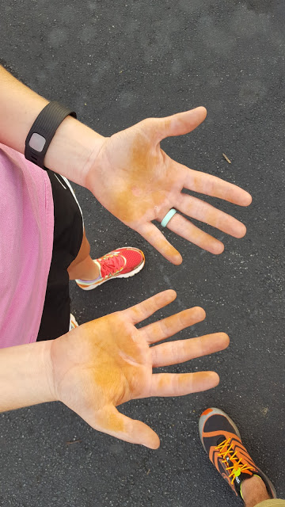
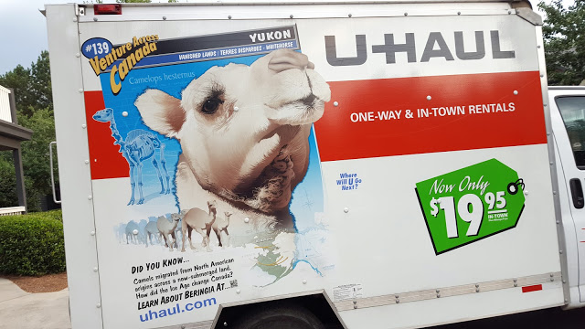

Last week flew by! I feel like I say that every week though.. They're all just flying! Now things are getting back to semi-normal though. Here's my crazy week:

**Monday** I'm sure work was crazy, and then when I got home, I had to set up power and cable and other stuff for our new place! We officially got our new apartment! It's literally a mile away, on the other side of the river. We also gave our 30 days notice to our old apartment! Shaun and I went to Total Body Fitness, and we did some monkey bars, and I tore my hand open a little bit! Afterwards, we got Moe's. For me, it hit the spot, but for Shaun, not so much.

**Tuesday** I learned at work that I would have to do a deploy at midnight. I thought it'd be 12,  noon,  because that makes more sense, but no. I wasn't excited about being away for over 24 hours. To try to keep on schedule, I went to kickboxing, went home got to blog for a minute, and then it was time to work. Long story short, my computer wouldn't connect to the intranet so I couldn't do it. But of course this all happened at 12:30am and I was up for an hour troubleshooting and then when I tried to go to bed,  I couldn't because I was super stressed and was scared I'd be in trouble the next day.

**Wednesday** I went into work late since I stayed up so late. (originally I wouldn't have worked but didn't earn the hours). Since I wasn't able to sleep in super late, Shaun and I signed our lease and got our keys to our new place. After work, we went to our storage unit, went through what we were keeping, took a carload to goodwill and 2 x 2 cars worth of stuff to the new place. I never thought I'd see the day when it was empty again! A weight off our shoulders!

**Thursday** Work seemed to fly by and then it was back to the new place to get the Internet set up. We have a different provider now and it's cheaper for double the speed. That's totally cool with me! Plus I bought a new router since our old one barely covered our 848 Sq ft apartment. ( now we're over 1,200 Sq ft!). We also get a cable box that's included in our community fee, so it'll be interesting to see if we watch cable. Probably when the Walking Dead comes back on!

TBF was insane. 20 mins continuous. Plus the heat. Woof.

**Friday** After work I did happy hour with my. K-Bestie, Kelundra! We got margaritas and ate way too many chips! Uncle Julio's has great chips, salsa, and guac! I got home, had to do some work, and then moved some stuff to the new place. When Shaun got home we moved our dresser over. We're going to use it in our dining room (we fancy now!) as a buffet. We finally unboxed our 2 sets of China from our grandmothers and put them into the 'buffet'.

**Saturday** We decide to move today. So we went to the gym,  and then got a uhaul. Then it was go time. We took a break at the pool because it was 100 degrees outside, and then kept at it. My parents came over and helped, saw the new place and then left. We stayed up until after midnight...

**Sunday** More Moving! Luckily we still had the uhual, and cleaned out the rest of our apartment. My mom came over and we just got it all done. Then it was onto the new place to unpack EVERYTHING. My dad came over, and we all had dinner. After they left, we kept unpacking, and had to remember to take back the truck! Luckily the people at the place we got it from were SUPER nice and said we didn't have to return it after exactly 24 hours. (if that was the case, we would have been screwed!). On the way to our new home, we stopped by the old place to turn off the a/c, patch some holes and grab 2 things out of the fridge (that we ended up forgetting...again). We also set up Shaun's tent, because we plan on "camping out" sometime this weekend in there! Haha

**_Don't you looooove moving??_**

Join the Weekly Wrap with [Hoho Runs](https://hohoruns.blogspot.com/) and [MissSippiPiddlin](http://www.misssippipiddlin.com/)!

Connect with me:

[Instagram](https://www.instagram.com/codebikerun/)

[Twitter](https://twitter.com/kaleighcodes)

Pinterest

[Bloglovin](https://www.bloglovin.com/blogs/codebikerun-12713491)
