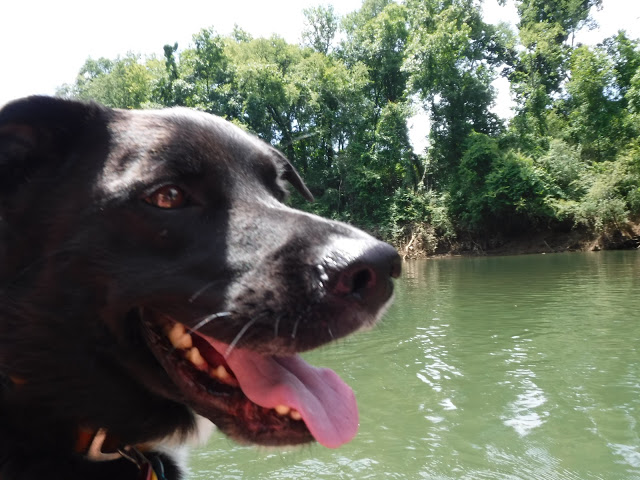
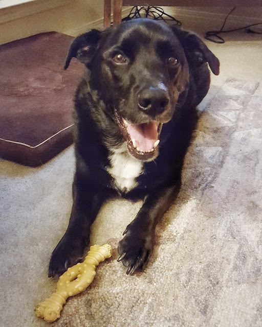

#CrazyDogLady alert!

A few months ago, after scrolling though my own [personal Instagram](https://www.instagram.com/klgh.js/), looking at corgis, puppies, and any kind of dog, I thought it'd be so amusing if I made one for my dog, Mac.

[So I did.](https://www.instagram.com/macandbiscuit/)

I find it both funny and awesome. Not only does it allows me to post more pics of my dog, but I can follow ALL THE DOGS and it's not weird. I have found other [corgidors](https://www.instagram.com/explore/tags/corgidor/) (or [corgadors](https://www.instagram.com/explore/tags/corgador/)), dogs in Atlanta, and all over the world. I write as if I'm the dog. It's just a good time.

Some of my friends and family follow [Mac](https://www.instagram.com/macandbiscuit/), he follows them back too. I think most people know I'm crazy ridiculous but not about my dog. He is my fur-baby, so he's SUPER spoiled. But I don't push him around in a stroller or anything. Shaun and I make sure he's a happy pup, give him Party Poppers, and buy him bones when we feel guilty about being too busy.

Of course it would be super cool if Mac was like super famous and my job was to just post pictures of him all day. I'd be fine with that, but Mac knows when I'm taking pictures of him and ALWAYS looks away. So that'd be pretty hard to maintain.

So, why do I do this? Because it just makes me happy. It's fun to see other dogs like Mac since he's such a random breed, if I'm having a bad day, it's just fun to scroll through the feed or post new pictures. Try it and you'll see!

_**Do you have an obsession with dog Instagrams?**_

_**Which are your favorite?**_

**[Follow Mac Here!](https://www.instagram.com/macandbiscuit/)**
