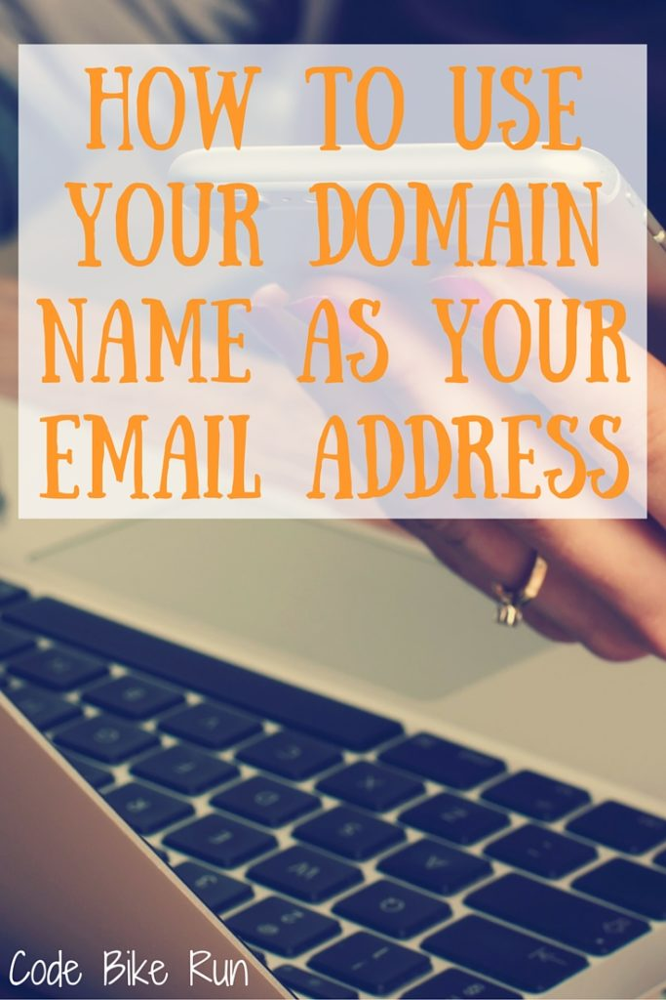
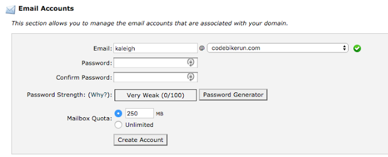
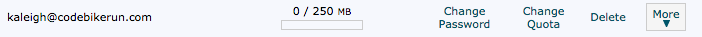
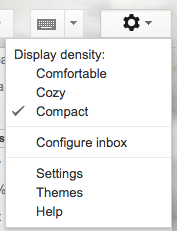
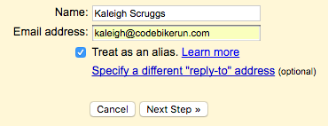
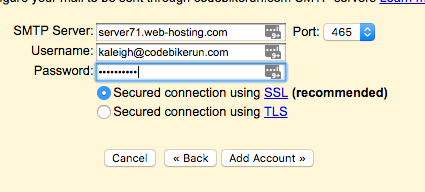
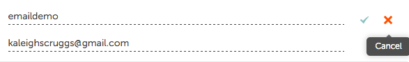

Welcome to the 2nd installment of Tech Tuesday!! If you missed the first one, How To Buy Your Own Domain Name, check it out! So, once you've purchased your domain name, now you're gonna want to send emails using your new fancy domain! Here's how you can do it without throwing your computer across the room! There are 2 ways...if you bought hosting, and if you just bought the domain name:

**If You Bought Hosting**

Log into the cPanel. This is where all the magic happens that you don't see. For NameCheap, I click on Email Accounts, and then can add new ones for any domain that I'm hosting. For this example I'm adding kaleigh @ codebikerun.com.

Here it lets me choose the address I want, and then I set my password, and hit Create Account.

Now it shows up in my list of emails

So this gives me an email address, but I have to go through the software on my hosting account to check it. Which is no fun when you're a Gmail lover like me. Lets add this bad boy to Gmail!!

I use the same Gmail account and all sorts of emails are forwarded to it. This will be one of those.

Head to Gmail, and on the right hand side, click the gears icon and then Settings.

Click the tab "Accounts and Import"

Find the button "Add another email address you own"

Now the fun part. A little box will pop up. under name, put the name you want to show up when you send emails.

Click Next Step, and don't freak out.

On my hosting it lets me 'Configure Email Client'. That gives you a TON of info that you wouldn't normally know.

My SMTP Server is: server71.web-hosting.com

Find your SMTP port as well.

If your hosting doesn't have options like these, don't be scared to Google _name of service_ SMTP Server.

your username is the full email address, and the password is the one you just created for it.

Now you'll get an email to that hard to find inbox through your hosting. Find the email from Google that is sent there.

Click the link to confirm, or enter the code, and you're good to go!

Gmail allows you to make different emails the default and there is a Labs that allows you to send from that email as well (and if someone sends an email to that email it's automatically the reply email).

**If You Bought Just The Domain Name**

This is much easier,_but_ doesn't let you send emails as your domain name...just receive.

Find where you can redirect or forward emails to your account. With my hosting, I just just click 'add forwarder' and enter the name I'd like to use.

Boom. Done!

