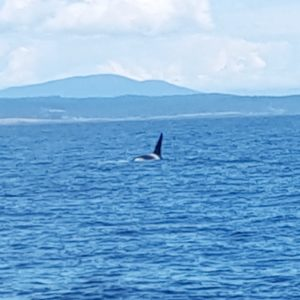

So I have moved my blog from being hosted at Blogger to self hosted WordPress. I feel like I've done this a lot. It is a little crazy, but I just love using different platforms, learning what's new and 'better'. So if you're new here, I guess there's not change, and if you're not new, Hey! But either way, It is a hot mess right now so please don't judge!

We are officially out of our old apartment. So that's a little sad, but also nice to have one less thing to worry about. Now we **need** to finish unpacking and clean up our lovely office. It has become the junk room where anything and everything has been going that doesn't go with the rest of our place. Ugh! I'd really love to use it, or at least have the option of using it.

I have started doing jiu-jitsu. Okay, so far I have only done it once but it was fun and I plan on going back to the beginner class tomorrow. I also need to find and buy an awesome gi for women so I can go on Tuesdays.

I'm signing up for a stand up comedy class. I have been wanting to do this for almost a year now, but every time I look it up I just miss the sign up period. So I finally wrote it on my calendar! I'm super excited (and nervous of course),plus at the end of class you perform your set in a graduation show! (which also happens to be the day after the Amy Schumer show!).

I'm going out of town twice in the next 2 weeks to see Coldplay. I am so excited to be volunteering with Oxfam again and being able to see the show for free. It makes the traveling worth it since they're not coming to Atlanta

I have been listening to [The Life-Changing Magic of Tidying Up](https://www.amazon.com/Life-Changing-Magic-Tidying-Decluttering-Organizing/dp/1607747308). It is making me want to throw out all my clothes and buy stuff I actually want to wear. It's also making me go crazy when I'm not home and available to clean up the office! I'm not done yet, but I am loving the book!

I signed up for a 5k in October. I know it's a short race and like 10 weeks away, but I haven't really ran all year, so this will be a long road to get back in the game, pain-free (is that even a thing).

aaaaand that's about it. Just trying to organize and live life. I'm working on a Seattle recap, but until then, here's a picture of a whale!

