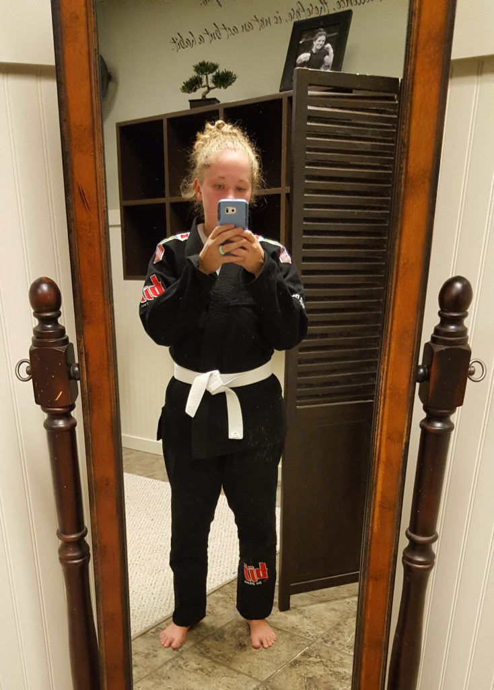

Oh hey there!!! I feel like it's been forever since I last posted...mainly because it has been forever. Lots and lots has happened since then. I have slowly been working on recap posts from our trip to Seattle. Emphasis on the slow. I've also been to 2 Coldplay concerts since I last posted! Which of course was SUPER exciting! Recap of those coming soon as well.

I have been loving jiu-jitsu, and even did 2 classes in a row on Tuesday (I was very dead afterwards). It's a ton of fun, and took me a while to find a gi, but I ended up just buying one from my gym. So it's not specifically for women, but it fits so no complaints! I also of course will write about jiu-jitsu because there's not a lot of resources for women online and that kind of stuff always annoys me!

We have been battling poison ivy in our house for over a week now. I think it's been well over a week. Long story short, it started out with me using the wrong leaf in the woods, but thanks to a video on YouTube we found, I was able to walk away from that nightmare unscathed. But a few days later, Shaun had noticeable signs of The Ivy we call it now. He *still* has it, and I have it a little bit as well. We have no clue how he really got it, but we've been doing laundry and cleaning anything and everything it could have gotten on like crazy. Note to self: say no to poison ivy!

Shaun finished his 1st semester of grad school with all A's! Aaaand we just paid for his fall semester! (bye $$$$$$$). Paying for school sucks, but luckily we're able to do it for Shaun without getting loans. I can't wait for the day that I have mine paid off (check back in at least a decade, unless I win the lottery).

Who's watching the Olympics?!?! I'm watching swimming right now as I type this. I love that and gymnastics! Triathlon is also pretty fun to watch but they don't cover it too well. Since we have cable now, I'm excited to watch as much as I can though!

That's it for now, Mac really needs to go outside, and I need to finish some recap posts before I forget everything!!

