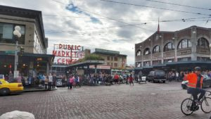

Good Morning! A month I was in the beautiful Pacific Northwest! Seattle to be exact! It was my first trip that far west, and everyone told me I'd love it and not want to come back...and that has ended up to be very true!

I wanted to recap our first few days in Seattle! We were there from Saturday-Friday, but this will be Saturday-Tuesday!

**Saturday**

Saturday morning, we woke up after "sleeping" for 2ish hours (our flight was at 8:50, so we were going to try to just stay up..nope (also, bad idea)). The plan was to meet Shaun's brother and sister in law at our old apartment (they lived in the same complex as us) by 5:20 to get an Uber to the MARTA station. Once we were dropped off, and got on a train. Somewhere around downtown, the train hit something and stopped. We have no idea what really happened but we weren't stopped for too long. Checking in and security were pretty quick, and we had enough time to get breakfast and for me to catch a Pokemon. No judgement.

This was my 1st time flying Southwest, so I was nervous that we'd end up with bad seats, but we were able to get 2 rows by each other, and Shaun was next to me. Flying over all of these states and mountains was amazing. Now I'm dying even more to explore the US.

\[caption id="attachment\_233" align="aligncenter" width="440"\] Mt. Rainier in the distance\[/caption\]

We landed, and I had my 1st orca sighting!!

 

After getting some gyros for lunch, and hanging out for a little bit, we went to downtown Seattle. We stayed with family friends in Issaquah, which isn't too far from the city. I was excited to check out the Kavu store, and see Pike Place Market.

  

 We stopped by the original Starbucks, and I got a drink, but it wasn't anything different than your usual SBUX. For dinner everyone got fish at Ivars Fish Bar, but I just ate fries because I don't eat fish!

**Sunday**

I slept for TEN HOURS. Obviously I was super tired and went to bed Saturday night at 7:30pm(10:30pm home time). Shaun and I got up and Shaun made breakfast for everyone. Soon after, my bro-in-law wanted to watch a soccer game, so we found a place to watch it called [The Black Duck Cask and Bottle](http://theblackduckcaskandbottle.com/). We got 2 flights and were able to try beers we've never even heard of before!

 

 Afterwards, we went back to the house, and all went to the 1st REI in downtown Seattle!

**Monday**

Shaun and I woke up and were ready to hike! There were trails right in the neighborhood we were staying in, so we just walked over to them! Cougar Mountain was on the edge of the neighborhood, so we did the hike up and we were just amazed at the greenery and scenery!

   

Once we got back from our hike, we went to the [Issaquah Brew House](http://www.yelp.com/biz/issaquah-brewhouse-issaquah) for some much needed snacks!

It's a Rogue brewery, so we tried beer and had some cheese curds (which were AMAZING).

 

Bill (bro-in-law) and his wife met up with us and we walked to another place down the street for more beer! And then to Black Duck again!

We went back to the house for dinner, and then went to see Snoqualmie Falls.

**Tuesday**

While talking about where to hike, everyone told us we needed to go up Poo-Poo Point to see the views...so we did the hike! It was a few miles up and down, but totally worth it! It was pretty steep and rocky, but there were a ton of people on the trail with us. The view did not disappoint! People use this area to paraglide (no thanks!) but we didn't see anyone up there.

   

Lunch was way overdue so we went to the Sunset Ale House! Shaun and I split a burger, and had this amazing dessert:

Afterwards, we went to another (and better) Kavu store in Ballard. After dropping some $$$ we walked around before going back to the house for dinner. We had been planning on going to Portland on Wednesday, so we talked about that and then went to bed.

Stay tuned for my Portland post!
