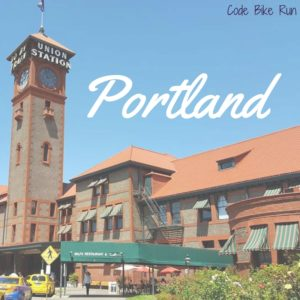
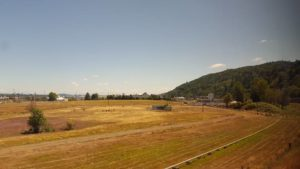
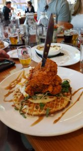
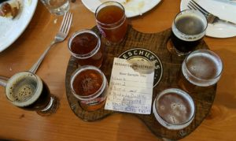
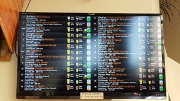
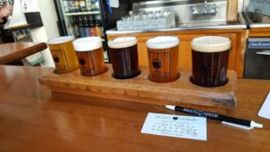
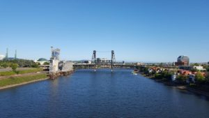

Compared to my Seattle post, this one will be much shorter since we were only in Portland for about 5 hours. We took the 9:50am train from Seattle, and arrive at 1:50pm in Portland. We definitely got some sleep on the train, but I also enjoyed watching the sights and drinking some tea.

Once we arrived, everyone was starving. We walked around looking for a place to eat, and found this awesome sigh outside of the Patagonia store:

We went to [Deschutes Brewery](https://www.deschutesbrewery.com/) for lunch. It was so good! Of course we got a flight, but Shaun and I split their chicken and waffles...so amazing!

 

Their beer was so good! I highly suggest trying some!

After lunch, we split up. The girls went shopping and the guys went to try more beer. Since I'm always here for the beer, I went with the guys. We went to [Bailey's Taproom](http://www.baileystaproom.com/) for some flights. I had read about it online and wanted to check out their digital beer list. It was super cool:

It had all the information you wanted to know...where it's from, how much is left, the price, all sorts of great info!

After we had our flights, we went to get donuts from Voodoo Donuts, but the line was very long and since we didn't have that much time, we decided to move on.

We walked around, went into some stores, but had to meet back up with our group. We walked across the Broadway Bridge, but then it was time to go back to the train station.

Portland was pretty cool, and I hope we get to go back and explore more and more of the state of Oregon!
