I was looking forward to seeing killer whales in the wild ever since I saw it pop up while searching for things to do in Seattle. Backing up a bit, I have always been a huge killer whale fan. Thanks to Free Willy, I was obsessed as a kid, and now love to follow Instagram accounts that post pics of orcas all day every day. So when I saw this was something we could do on our trip, I pretty much decided it would be done.

We did the tour with the [Puget Sound Express](http://www.pugetsoundexpress.com/tours/guaranteed-whale-watching-tours/seattle-whale-watching-tours/). It took me a while to decide on a company, but this one worked best with our schedule and where we were driving from that morning. We did the morning tour that left at 9:30am.

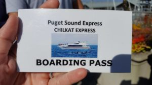

The trip was right on time, and we boarded, went through the safety info and we were on our way! Shaun and I went to the back of the boat to see the sights as we left the port in Edmunds, Washington. After a bit, I bought some tea and got a blueberry buckle (which is kind of like a scone). They make them fresh right on the boat, and it was amazing!

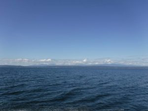

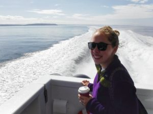 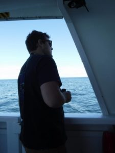

Lately humpback whales have been making an appearance in the San Juan waters, so we were able to get pretty close to them!

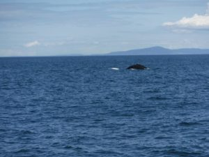 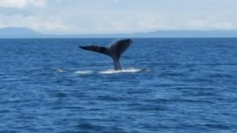 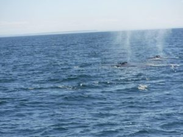 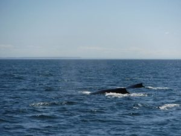

The humpback whales were really cool! They were so close to us, we could see and hear them very clearly! We also had borrowed some binoculars so those were awesome to see extra close with!

Then it was time to move on, and find some orcas!! On the way we looked at information about all the whales. The family that runs the Puget Sound Express really knows their stuff and had a lot of cool info to share!

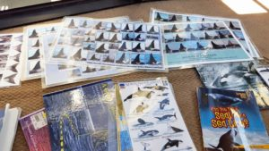

We saw 2 orcas in the water, a male and female. The boat couldn't get too close because they didn't want to get in between them. (I was kinda sad), but we still got to see them and it was AMAZING!!

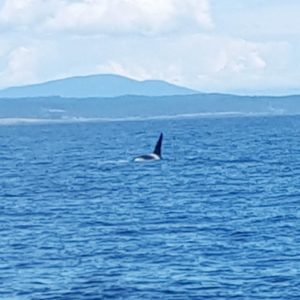 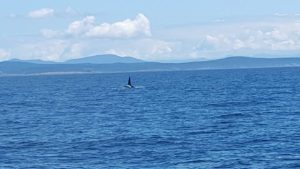 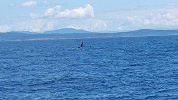 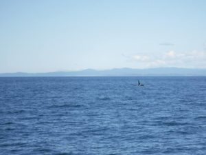

Then it was time for us to head back to Edmunds. I didn't take any pictures while we were there, but Edmunds is beautiful! I would love to live there! Such a cute little town! We went into all sorts of cute shops, got some cookies, and went to a brewery (of course!).

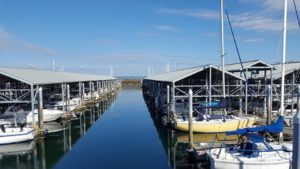
