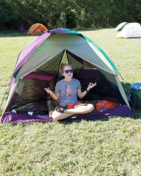

How is October almost over?? Last time I checked, it just started! This has been such a busy month for me. Work has been bugging me to do weekend work every weekend and I'm like LOL SRY BRO. They don't believe me, but it's true. My schedule has been jam packed every weekday and weekend.

I don't know where to start, but here's what's gone down:

We went camping and it was ALL THE FUN. My new sleeping bag is the warmest (32 degrees) and I can't wait to go again hopefully sometime in November.

I've been married for 2 years now. We had 2 year old wedding cake and it wasn't good, but then we waited a little bit longer and it ended up being good.

I saw Amy Schumer for the 2nd time. She is super hilarious, and all the people who say bad things about her talking about gun laws/politics/formation, have obviously not been a longtime fan.

I've been trying to get Coldplay tickets for weeks, but don't really want to spend over $1,000 on tickets to an out of town show. I don't make enough money for that.

I did my 1st open mic. I didn't bomb, but I didn't kill. I'll take it. I wasn't planning on doing it, so I wasn't ready and totally blanked, but it was super fun.

I'm doing another one TOMORROW night! And, Thursday night too!! I'm super excited.

I started my online class with The Second City. Also super excited about it. I also don't know what I'm doing, so that's great.

I'll try to post more often, but for real, I have barely had time to scroll through Instagram. Work has been cray lately.
