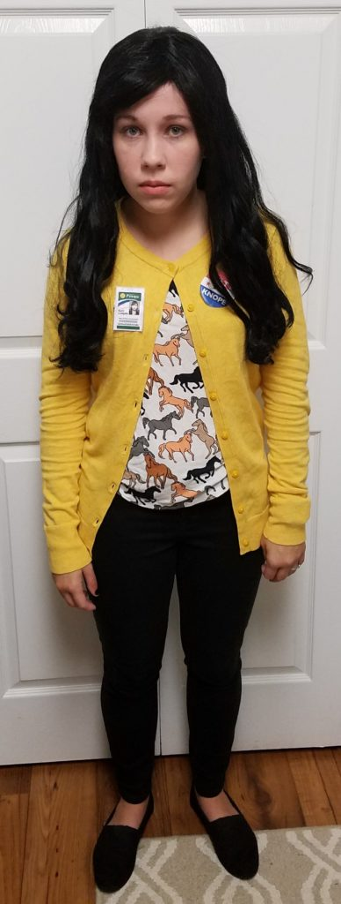
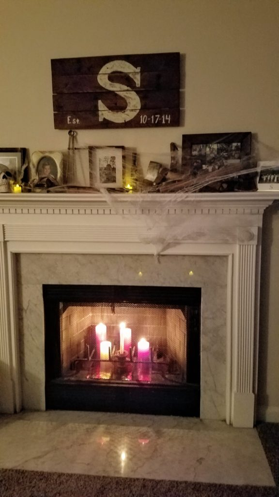
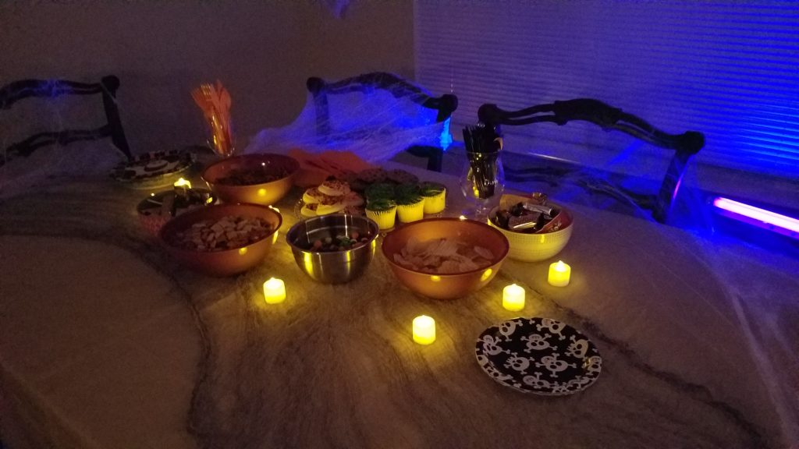
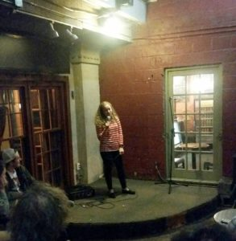

Merry Christmas! Happy Halloween!

Can you believe it's Halloween already? I am super pumped to throw on my Princess Leia costume today. The past 2 Saturdays I have been [April Ludgate](http://parksandrecreation.wikia.com/wiki/April_Ludgate) and Shaun was [Andy Dwyer](http://parksandrecreation.wikia.com/wiki/Andy_Dwyer). Not a ton of people watched Parks and Rec so they didn't really get our costumes. Lames.

 Super cute.

We had some people over Saturday for a party, and we totally decorated our apartment. I THOUGHT I took pics of every detail, but apparently not. So this is what I have:

 

Last week was super busy though! I had my grad show rehearsal at Funny Monkey on Wednesday night. It's at Java Monkey in Decatur, hosted by my teacher Joel. It was a lot of fun to watch my classmates perform! I was nervous the whole afternoon before, and then of course the hours leading up until it was time to leave. Once Shaun and I got to Java Monkey, we got some locally brewed GA Beers, so all was well in the world. I know a lot of people say to not drink/get drunk before you perform...I didn't get drunk don't worry. I had about half a glass of Emergency Drinking Beer , just to chill, ya know?!

But anyways...UM I LOVE DOING STAND UP. It was the most fun 5 minutes ever! At 1st I was nervous, and then I started talking and I was fine. It was a great feeling to get people to laugh and see what they were responding to. I LOVE IT.

Sunday was my graduation for my stand up class! Everyone did great! I did get pretty nervous (I think because we had to wait backstage), and the lights were SO BRIGHT. But it all went smoothly! I can't wait to see the video!

I woke up this morning not feeling too hot, so I worked from home. But since I had a lot of time to kill between the time I get up and start working, I made these super easy scones from Trader Joes! (just add water)

Okay, well, now time to get back to my über busy life. JKJKJK
