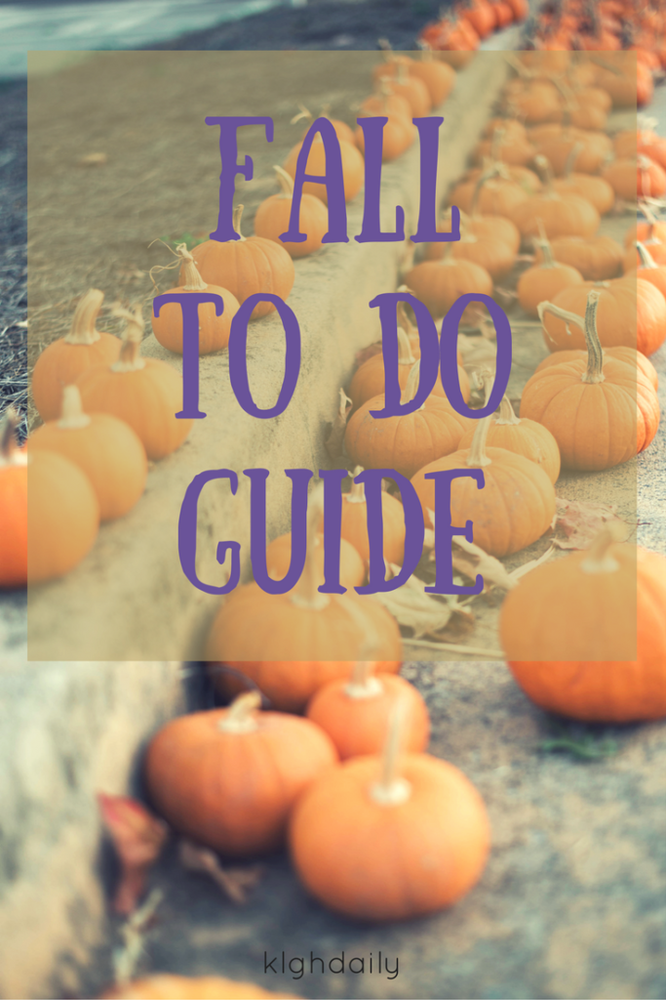

In case you're late to the party, it's fall ya'll! Halloween is over and it's time to get in the last "fall" to do's before winter "arrives" (I use quotes since the 1st day of winter is technically December 21, but we get in the winter spirit beforehand).

I don't know about you, but for me it doesn't really feel extremely fall like here in Atlanta. As I write this it's 81 degrees at 3pm in November. I'm not complaining; it's not humid or disgustingly hot. I'm super comfy in my leggings and short sleeves. My latest dog walking style has been that plus Chaco's. Super comfortable.

So, here are all the things I must still do in order to fully embrace fall before we transition to winter:

// Have at least one of each fall themed drink at Starbucks

// Take a photo of my shoes in the leaves

// Kick said leaves

// Wear a scarf

// Talk about how chilly I am before I get my warm Starbucks drink and then be thankful it warms my hands up #blessed

// BUY MORE CANDLES FROM BATH & BODY WORKS \*I bought tiny ones but they're finished already\*

// BOOTS

// Bake unhealthy treats

// Bake healthy treats

// Enjoy the cool weather when I get out of jiu-jitsu. And put a sweatshirt on 5 minutes later

// Bonfire \*an unnatural one, we're in some sort of burn warning right now\*

// S'mores

// Buy Bailey's (or Costco/Aldi knockoff) for my hot chocolate

//Talk about the time change

// Pin more sweaters on Pinterest
