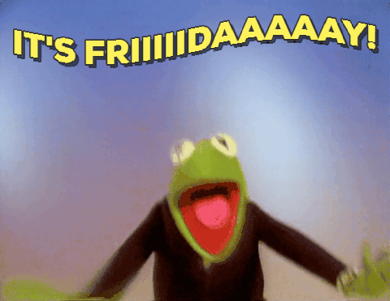
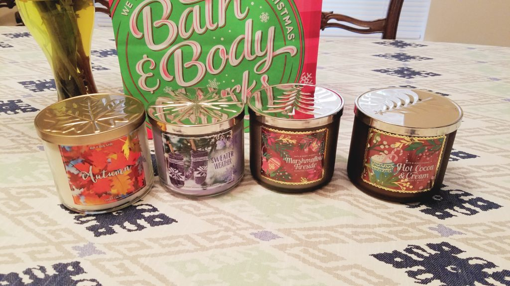
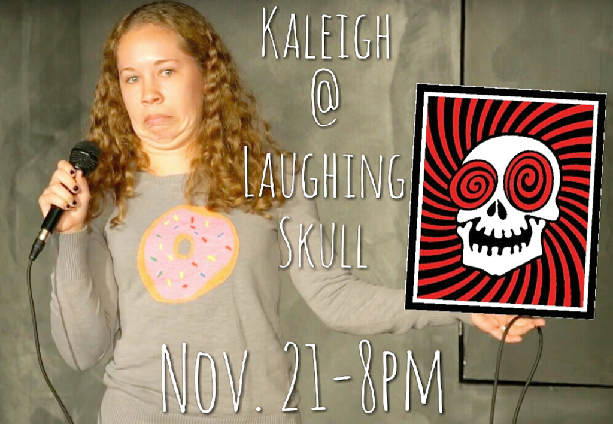

You guys, we did it!! We made it to Friday! After a very stressful and scary week, we're here, America's favorite day. We can finally hit up happy hour, let loose, and eat pizza until it hurts!!

I don't really feel like commenting on political stuff, except for: SHIT.

Ok cool.

So as I get back into the blogging game, I thought I'd share some Friday...fun?? five?? idk.

I bought some candles from Bath & Body Works. They had $10 off the big candles, which brought them down to $12.50 each. I didn't resist. I'm burning Autumn and Sweater Weather right now, and will move onto Marshmallow Fireside and Hot Cocoa & Cream later in the season #Planning.

> [A photo posted by Mac the Corgidor (@macthecorgidor)](https://www.instagram.com/p/BMmTu2zBl5g/) on Nov 9, 2016 at 9:56am PST

Mac has been having fun enjoying the snuggly weather lately. In the winter, that dog will not leave the bed in the middle of the night. In the summer, bye Felicia.

I WILL SAY IT. I'm ready to put up Christmas decorations. This is extremely unlike me because I have a December birthday (December 7th!) and have always campaigned for Christmas anything to start the day after. In the past few years, the tree has slowly crept it's way to my actual birthday. But I think among all the craziness of this week, I'm ready for some happiness, and to focus on making our apartment smell & look like the holidays.

For those in Atlanta, I'll be doing stand up at The Laughing Skull on Monday the 21st! Let me know if you want to come out. I've been trying to work on new stuff and will try that out on Tuesday at an open mic (let me know if you're interested as well). I'm getting my performance taped here too so I'll have 2 videos, and will decide which one to start sending out to festivals!! EEEE!!! #NoPressure

Side note, I REALLY love comedy, and writing stand up. Since I've been doing this for almost 3 months now, I've just felt...better...like I'm supposed to be doing this! #SAPPYFRIDAY

Last but not least....ATTENTION BLOGGERS! I have been thinking of doing a blog-hop type thing for a while now. Let me know if you're interested! I was thinking every other week at 1st then build up to 2. HOLLER AT ME.
