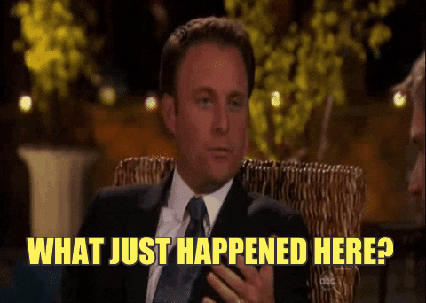

A local radio station is doing The Bachelor Fantasy League. So when I saw this ridiculous thing...I had to participate.

I used to watch The Bachelor. Like in 2002, when it first came on TV. I watched for a few years, and also watched The Bachelorette. Then I stopped, and now it's turned into this huge event every Monday and I have always wondered...WHY!?!?! So when I saw the fantasy league, I'm like, I should watch this and judge the sh!t out of it. So judge I shall.

I watched episode 2 and it's...crazy, to say the least. This is my play-by-play.

The episode starts with the girls jumping into matching convertibles for their first (group) date. Everyone is SO EXCITED (about the date AND the cars). But I don't understand why...it's a big group of women on a "date" with one dude.

They arrive at a house and are told they're doing a wedding themed photoshoot. This fancy photographer with an accent comes out and shows them the outfit and "theme" for each of the girls. Some get unlucky and have to be bridesmaids in an actual group photo. There's one AKWARD shoot where it's Nick and one girl is the bride and one is the bridesmaid and the bride is full on kissing him.

The girl who's the bridesmaid is PISSED! Throughout this whole time they're showing this girl Corinne's reactions, and you can tell she's becoming more and more pissed and is obviously planning something in her head. I think she may turn into the token psycho. We'll see.

Then it cuts to the girls who are at the house, and Liz, the one who has slept with Nick before, is bragging to the camera about how it's been so long since she's kissed him, since she kissed him 1st because they met at some people's wedding (they say their names like I'm supposed to know).

Now back to Corinne who is full of revenge and takes her bikini top off and makes Nick hold her "bosom" as she says. Then she wins the competition and gets her own "Nick Veil" (Nick Viall sounds like veil...okay I know too much now).

At this point I can't even believe I'm using people's names. I'M INVESTED PEOPLE.

Anyways, now they're back at the photoshoot house. And they're excited to talk and "steal" Nick. Guess who steals him 1st? Corinne. Then they start making out. Let's stop here and remember that she has a nanny even though she's 24. Now everyone is having time with him, and making out and whatnot.

They go back to the girls who stayed at the house all day, and they're all in PJ's. Um, what do they do all day there? Sit around and drink? Sounds kinda awesome but also boring. Very obvious where all the dramz comes from in the show. They find out that Danielle M. gets the 1st 1 on 1 date, and Liz is mad but not because she wants to figure things out with him. Can we also stop and remember that she shouldn't be acting like "we need to figure us out" because she said she was the one who didn't want to give Nick her number after their night together. YOU SNOOZE YOU LOSE GIRL! Now she's on this show. Come on!!

Back to the group date. Nick is getting 1 on 1 time with girls and then Corinne comes and interrupts..now the other girls are mad because she's already had a lot of time and here she is with #2 of the night. \*um, can't they just say no when someone is trying to steal time?\* Now the other girls hate her FOR SURE. She's not wife material, letting him hold her boobs, and now she might have had her nipple out while talking to him?! GIRL WE KNOW YOU'RE PLAYING THE GAME.

Dude, these people are CRAY!

Anyways, Corinne gets interrupted by Taylor, and then while Nick is talking to Taylor, Corinne returns and steals Nick AGAIN!! Taylor is pissed and after talking to some girls, goes back and re-interrupts them! BOOM BITCHES!

Now we've got conflict. When Taylor returns, Corinne tries to talk to her and be besties. This is the fakest thing I've ever seen. Then Corinne goes into a rant about being true to yourself and numero uno. Everyone is looking at her like biiiittccchhhh!!!!!!

Anyways, Nick comes out to give out 1 rose. I guess this is for like the winner of his heart??? IDK, but gets who gets it??? I CAN'T EVEN!!

Side note: are they all drinking constantly? I feel like that's the only way to handle this shit!

The first 1 on 1 date is with Danielle M., who is apparently the nicest girl EVERRR. They take a helicopter ride and then it lands on a yacht. They're from the same hometown, cayooote! They get their champagne and cheese and chat.

Back to the house, we have Liz talking about her ONE night with Nick. Again. In one of the scenes, she's cutting up some fruit, and there's a girl sleeping on an ottoman or something behind her. So weird.

 Liz tells Christen about her night with Nick, and now she's the only one who knows.

We'll see how that goes.

Back to the date, Danielle and Nick talk about her past and then Nick gives her a rose. I guess if he didn't like the date he wouldn't give her a rose? Now Nick, Danielle and the Rose all go on the Ferris Wheel and make out some more.

At the house, we find out who gets to go on the 2nd group date (how do they decide these things?). The card says "we need to talk..." and Liz gets picked. How fun!!

The girls go on the group date, and go to Museum of Broken Relationships, to learn about Nick's past. They get to witness a 'break-up', and then learn that they have to be a part of this public break up symposium. While they're walking around, Nick is avoiding Liz, and Christen notices. Now Liz is crying because she just wants to MOVE FORWARD!

The break-up symposium starts, and everyone is having fun with it. Then Liz goes up and makes it WEIRD. She reads from a note and gives some history to their less than 24hr relationship, everyone is like "she's really into it", and Christen is like "does everyone else know?", and Nick is like "THANK YOU PRODUCERS".

Now Liz is emotional, and Christen is trying to be a friend to her. Nick is sitting there like, WELP GOTTA TALK NOW. He's "living his nightmare".

When Nick is talking to Christen, she tells him what Liz told him. So now he really has to handle things so the girls all don't think he's keeping stuff from them. He pulls Liz aside, and it goes to commercial!! But when it comes back, they have a pretty intense convo about why she's gone about this the way she has...basically, if you wanted this dude's number, you just need to ask your mutual friends to set you up, not go on a TV show!!!

While all this is happening, Christen is making it obvious she knows what's going on without saying anything. So now the other girls are über curious. They cut back to Nick and Liz and he tells her he's done with her and she needs to GTFO. Her face is amazing, but what did she expect?!!

Nick goes back to the girls and tells them he sent Liz home, and what happened with them. When he says that they DID IT at the wedding, we get a TO BE CONTINUED. But to keep it lighthearted, they play a clip of Alexis coming out with cupcakes with candles lit to celebrate her Boob Day. There really is a 1st time for everything.

So to recap, this show is quite crazy, and I may be a little excited to see the next episode. I hope you enjoyed my commentary + gifs. Let me know your thoughts on this show in the comments. PLZ!

follow me:

[Twitter](https://twitter.com/klghshaun) | [Instagram](https://www.instagram.com/klgh.js/)
