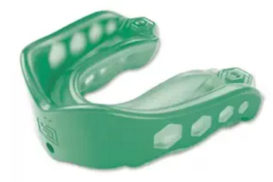

When I first started jiu jitsu, I had NO IDEA what to wear! For my first couple of classes my husband told me to wear a white shirt and shorts with no pockets. Cool beans. But I needed more info. There aren't a ton of resources for women who do jiu jitsu online. I found a few, like [BJJ Grrl](https://bjjgrrl.wordpress.com/) because I needed straight up info!

Now that I've been training for 6 months (how'd that happen?!?!), I feel like I can share some info that may be helpful (or just give you insight) to other ladies.

# Gi

For Gi classes, I like to wear a pair of Nike Pro Compression shorts under my gi pants, sports bra and a fitted tank top or dry fit shirt under the top. And of course my Gi and mouth guard (see below).

I have talked to a few girls at my gym and we all wear different things underneath. Some just wear underwear under the gi, so it's whatever you're most comfortable with. Personally, I have witnessed my gi pants come untied MANY times and I wouldn't want to be wearing just underwear underneath if they were to ever start to come off!!

# No-Gi

For no-gi, I started out wearing my Nike Pro compression shorts, but had to adjust them a lot. I tried a pair of running capris but they didn't have a drawstring and I would always have to pull them up.

I went to Lululemon ($$$$$$) and found these [Speed Shorts](http://shop.lululemon.com/p/women-shorts/Speed-Track-Short/_/prod1450110?rcnt=16&N=7yv&cnt=30&color=LW7FBMS_023739). They had more/different colors in the store. Even though they are pretty expensive for shorts, they are worth the price. Not only are they super comfortable, they have 4 pockets plus 1 hidden pocket inside a pocket, drawstring, and are long enough and high enough that I'm not scared of wardrobe malfunctions. Definitely worth it. Plus the pockets are discrete so they won't get in the way, and are great to put my mouthguard in when I'm not wearing it.

I actually bought another pair of shorts from Lululemon, but I can't remember the name of them. They are a little bit shorter, but the waist is much higher and has a drawstring and pockets as well. If I find them online, I'll update!

Shirt wise, I have to wear my gym's white belt shirt. I have 2, one is a dry fit shirt with short sleeves. The other is a long sleeved [rashguard](https://breakingmuscle.com/learn/the-top-10-bjj-rashguards-for-women). I really love the rashguard because it has an elastic band at the bottom so it doesn't ride up as easily, and the long sleeves are nicer. Last but definitely not least, find a good sports bra. I really love the C9 sports bras from Target!

# Other

After class I ALWAYS change. If we had a shower for the women, I would totally shower afterwards.  Gotta keep good hygiene. I even keep some baby wipes in my gym bag just in case, and use hand sanitizer before I leave. We usually go straight home (also grabbing food on the way) and I get in the shower as soon as I can. It's SO important to keep good hygiene when doing jiu-jitsu! Jump in the shower and put your dirty clothes in the washer! (also with me and my husband doing jiu-jitsu about 4-6 times a week, we do a TON of laundry).

**Gym Bag**. I use my [Kavu Duffy](http://gearx.com/kavu-duffy?gclid=Cj0KEQjw9b6-BRCq7YP34tvW_uUBEiQAkK3svQqFbTHBfQoQ1LRMyduVFfkP50XmeCYujxG_7cNAsjcaAn_u8P8HAQ#491=19449) bag. Just like with any Kavu bag, there's a ton of pockets and storage. Plus it stands out among the rest of the bags in the locker room.

**Mouth guard & case**. [This is the mouth guard](https://www.amazon.com/gp/product/B00I1BDL6A/ref=ox_sc_sfl_title_4?ie=UTF8&psc=1&smid=ATVPDKIKX0DER) Shaun has been using for years, so I bought one too. [The case comes separate](https://www.amazon.com/Shock-Doctor-Mouthguard-Case/dp/B00YH98VO2/ref=pd_sim_200_1?ie=UTF8&refRID=T974G26Q8J0G4XV3PKPG), but I love that you can clip it to things.

**Water bottle**. You will need it. Keep it full & icy.

**Hair ties**. When I wear my hair in a bun, I use these [non slip hair ties](https://www.walmart.com/ip/Scunci-No-Slip-Grip-Hair-Ties-The-Evolution-28-count/21143634?action=product_interest&action_type=title&item_id=21143634&placement_id=irs-106-t1&strategy=PWVUB&visitor_id&category=&client_guid=f333a228-e6a6-40e9-8d8c-001ca3e745b5&customer_id_enc&config_id=106&parent_item_id=21693275&parent_anchor_item_id=21693275&guid=b9180f2c-a0a4-462d-aa99-cd99bc93b11c&bucket_id=irsbucketdefault&beacon_version=1.0.1&findingMethod=p13n) (also good for swimming and running). I also just use the regular hair ties and use one for the pony tail and another for the bun.  I also like to braid my hair which has been a lot nicer on my hair line. For those I just use regular skinny ties.

aaaaand there you have it. My lovely list of things you'll need for jiu-jitsu! I hope this helps someone, or just gives insight on what you need for jiu-jitsu. I just know that when I was trying to figure out what I needed (specific to women), there weren't a lot of resources online.

If you have questions or comments, please let me know!

Follow me on: [Twitter](https://twitter.com/klghshaun) | [Instagram](https://www.instagram.com/klgh.js/) | [Pinterest](https://www.pinterest.com/klghshaun/) (I even have a [jiu-jitsu board](https://www.pinterest.com/klghshaun/jiu-jitsu/)!)
