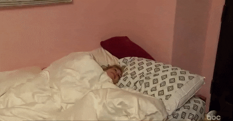

Alright peeps, it's time to recap the 3rd episode of The Bachelor. You can catch my recap of episode 2 here. (I didn't recap the 1st one).

Picking up where episode 2 left off...Nick tells "the women" what happened with him and Liz. Everyone is going crazy, they're all shocked, and talk about it before they have to go to the rose ceremony. At the beginning of the night, Nick explains what happened to the whole group. So now he gets drilled by all the women and explains himself a billion times in all the 1 on 1 chats.

Corinne is not failing to entertain. She's shown in the bathroom with just underwear on putting on a trench coat. She's so glad that Liz is gone because "she had intercourse with Nick before me". LEGIT THAT IS WHAT SHE SAID. This girl is CRAZY.

COMMERCIAL - and then we see Nick and one of the girls roasting marshmallows.  JEALOUS. Then it cuts back to Corinne, who has apparently ditched the underwear under her trench coat. She goes to see Nick, and she tells him to pass her the whipped cream. She sprays some in his mouth, and he's like is this *really* happening. She puts some on her boob and makes him lick it off. NOICE ABC. All the girls are watching through the windows and are not happy about it. Nick is trying to control himself after the whole "Liz Situation".

Jasmine G stumbles upon them and she's like oh, ummmmm WTF. Naturally! So awk. Corinne is pissed, and crying in the bathroom. She's so upset her plan didn't work. She just wants to go home to her nanny. Does he know she has a nanny yet??

Now it's time for the rose ceremony, and Corinne is busy snoring cuddling her rose.

Right before Nick gives out his 1st rose, he asks where Corinne is. He doesn't like that she's gone even though she has a rose (great, now please go home lady).

How does he remember all their names?? So who does go home? Elizabeth, Hailey, and Lacey. Byeeeee.

Now it's time for the next group date...featuring The Backstreet Boys! Talk about being jealous if you're not going on this date! I would be so mad. So now these girls put on workout clothes and then do their MAKEUP. WHAT? I don't get it.

Corinne is more excited to see Nick than The Backstreet Boys. OF COURSE. They find out they have to learn a dance, and the best dancer will get serenaded on stage with Nick. Corinne is pissed that she can't dance and has bad short term memory and is crying in the bathroom...AGAIN. I sure hope there's a Bachelor drinking game where you have to drink every time someone cries! JEEBUS.

They have the concert and all the girls dance, but Danielle gets chosen to dance with Nick on stage in front of EVERYONE. Kinda weird but okay.

Guess who is pissed that Nick kisses Danielle on stage??

After the concert, they all go drink and have their one on one time. GUESS WHO STEALS NICK FIRST? Corinne talks about how she hates "planned dancing".  Meanwhile, the girls are like CAN WE STOP TALKING ABOUT CORINNE?! PREACH. Now she's off somewhere getting some more sleep. WTF.

Back to the house...the girls get another date card. Vanessa gets to go on a date, and her clue is "floating".

BUT THEN THEY CUT BACK TO CORINNE. SHE SPILLS THE BEANS ABOUT HER NANNY! Raquel makes her bed, makes her cucumber and vegetable slices for lunch, lemon salad, cheese pasta, and laundry. She doesn't stop it because she doesn't want to stop Raquel's happiness. Now everyone is drinking and falling and waiting to get the group date rose. Danielle gets the rose, and Corinne thinks it's because Nick doesn't want to put a target on her back. OKAY.

Vanessa arrives to find out they get to go on the Zero G plane and float in space! Pretty legit, I must say.

They were having a lot of fun floating, and then she got sick. Nick was super nice about it and then they even made out after. THEY ARE WILD.

Meanwhile, another group date card arrives. "I'm done playing the field"...oh snap! Back to the one on one date. They go to the tallest building in LA for dinner. They have a really good convo about why they're here and what they want. NICK & VANESSA 4EVR.

Now time for the 2nd group date. The girls arrive at a track and wave to Nick as he runs towards them, then he says he brought some friends with him...aka Olympic Athletes. They're all going to participate in a Nickathlon. PRESH.

The activities were pretty silly. Like A Limo Long Jump, Jumping into Nick's Arms, and a Javelin throw, throwing arrows into a heart.  Next the group is narrowed down to 3 ladies. They find out the winner gets to spend time with Nick in the hot tub (like it is it's own activity?!?!). Astrid wins because she picked the ring off the ground after it fell.

NOW EVERYONE IS FRUSTRATED!!!!!

Dominque is super upset about not getting out of the house until now, and then gets overlooked.

Then she sees Nick making out with Rachel. So when it's her time to talk to him, she kind of goes off and gets a little crazy. Eventually Nick sends her home since he can't see the relationship going any further. When everyone is like "where's Dominique" he gives Rachel the rose.

Back at the house, we find out that instead of a cocktail party, Nick wanted to have a pool party. The girls become animals and start kissing on him and putting his sunscreen on for him. Then they cut to Corinne who lets us know she has something up her sleeve. She has a bouncy house and tells him to get the eff in there.

SIDE NOTE: There's a lot of blurring on the bathing suit bottoms.

Corinne gets on top of Nick in the bouncy house as the girls all look on. This girl is a psycho animal! And then she goes and falls asleep in her bed, snoring.

The other girls begin to tell Nick that Corinne has a nanny and they're beginning to question him since he's putting up with her behavior.

At the very end of the episode, we're serenaded by a very bad song to make us hurry and turn the TV back off.

follow me:

[Twitter](https://twitter.com/klghshaun) | [Instagram](https://www.instagram.com/klgh.js/)
