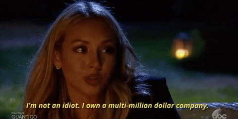

If you're new here, I've been recapping The Bachelor because it's been YEARS since I've watched it, and am totally out of touch with reality shows, so I thought it'd be fun to watch it from my outsider's point of view and laugh at all the ridiculous parts. With gifs of course. So lets dive in:

This episode begins right where episode 3 left off. The girls are all mad about Corinne's behavior and Vanessa went to talk to Nick about it. She was very straight up with him about it and made sure that he knows no one is impressed with her actions.

Chris Harrison comes out to let everyone know the party is over and it's almost time to do a rose ceremony!  Two ladies go up to Corinne's room to let her know she needs to cut the sh!t and pull herself together. Corinne still doesn't get it and gets her evil grin on.

Rose Ceremony time! Everyone is MAD! Corinne got a rose, and Christen and Brittany (who?!?) got sent home. 15 ladies are left, or should I say 14 ladies are left and 1 girl. BOOM.

Chris comes in and lets the girls know they're heading to Milwaukee, Wisconsin to Nick's hometown to visit his family and do some dates.

When they arrive, they find out that Nick is going to thave a one on one with Danielle and see his town.

They walk around and see some sights, and then go into a bakery, where they get to decorate some cookies.

THEN THEY JUST SO HAPPEN TO WALK INTO ONE OF HIS EXES! WHAT A COINCIDENCE!

They get some coffee of course and chit chat. Whatevs. Then they go to a park and sit and chat and make out for a bit, then get some drinks and chat some more.

The girls are at their house and they get a date card...It seems like most of the girls get picked, and Raven gets a one on one. She's super excited because it means Corinne doesn't get a one on one. Boo yaahh!

Flash back to the current one on one, and they do a 'bucket list item' which was dancing on the stage while Chris Lane (???) plays.

Cut to the FARM CHORES. Corinne is already complaining that she'd rather be in a spa being fed a nice taco - a chicken taco.  Of course. Nick wants to see which of the women can handle being on a farm and getting dirty.

The ladies watch as Nick tries to milk a cow. He wasn't good at it. WHAT DOES IT MEAN!?!?! Jaimi is really good at it. So watch out fellas! Most of the girls are complaining about shoveling poop, but who is complaining the most?? Corinne. duh.

Luckily Corinne respects Nick for being able to shovel the poopy. HER WORDS NOT MINE. They all get some drinks (can that girl even drink yet??), and start their one on one time. Girls are telling Nick they want more time so they can talk (in general), and while that's going on Corinne feels the need to tell the group off. They are grilling her maturity to see if she wants to marry a 36-year old man, why she wants a bouncy house and wants to go to bed early. HOW DARE YOU NAP! Oh and Corinne stepped in poop,  lost circulation in her fingers and almost had to go to the hospital apparently.

Please shut uppppp.

Later, Kristina tells Corinne straight up that she needs to really think about what she's doing and what she's in for. Corinne then goes to Nick to discuss it. Corinne had an "adult convo" because they didn't kiss. Next, Nick gives the rose to Kristina, but they showed Corinne's face and she legit thinks she's about to get it. THIS GIRL IS CRAY!

Now we go to Nick and Raven's one on one. She gets to meet his litter sister Bella at her soccer game. Nick leads the team in a warm up (weird). After watching the game for a bit, he takes Raven over to meet his parents. FUN! Next they go roller skating, and Raven gets to chat with his sister.

Next they go and have a magical dinner, and chat. They ate in this giant empty room...isn't that magical?!?! Anyways, she tells Nick the story of being cheated on and how she found it out. They both have this in common and he gives her a rose. Then they rollerblade around this empty place.

Now to the whole group at the rose ceremony, in a cute little barn like area. Danielle takes Nick 1st and the girls are pissed because she already had time with him and guaranteed that she's there longer. Corinne is getting amped up over Taylor, and is really hating her now.

Corinne gets under a blanket with Taylor so she can call her out. HOW COZY! So they chat, and Taylor is talking about intelligence and lets Corinne know she doesn't think she's ready for big girl panties.

Corinne can't even and wants to punch Taylor...and now TO BE CONTINUED! But in the credits we're entertained by the fact that someone could be an alien. BAHAHAA!!

Until next time...

follow me:

[Twitter](https://twitter.com/klghshaun) | [Instagram](https://www.instagram.com/klgh.js/)
