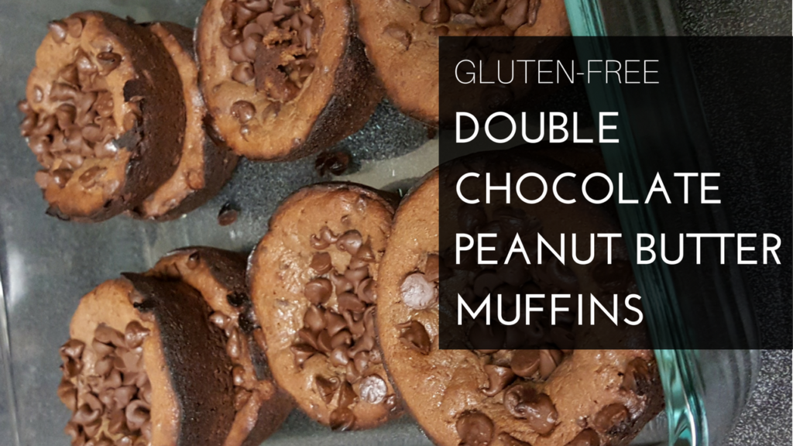
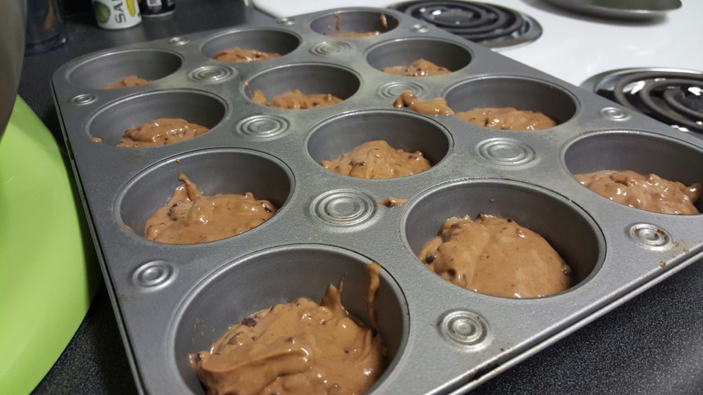
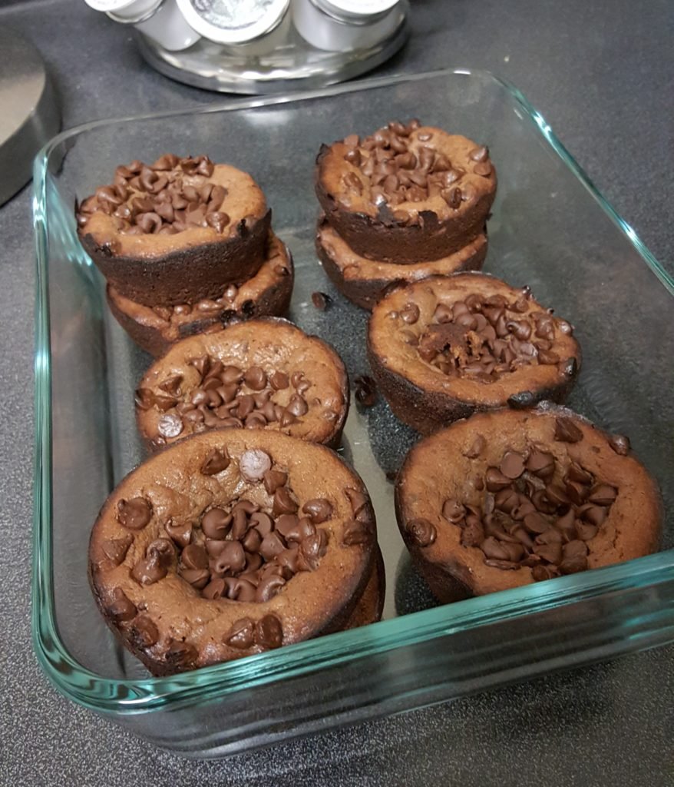

It is definitely baking season, and these Gluten-Free Double Chocolate Peanut Butter Muffins are one of my favorite things to make. They're super easy and are perfect if you have a bunch of bananas that may go bad soon. Most people make banana bread, but I make these (although I had so many bananas left over last week that I actually made banana bread for the first time just to mix (literally) things up).

These muffins have been a staple since we started changing up our diets over 2 years ago. We started [The Virgin Diet](https://amzn.to/36t59aM) and needed something sweet in our lives. These muffins are gluten-free and can also be low fodmap by substituting maple syrup instead of honey.

Before I get into the recipe, I made these early last week for a party I was supposed to go to on Saturday...these muffins get better over time so I made them when I was still feeling good, but then got super sick so I couldn't go...and now we have a ton in the fridge. I guess Shaun and I will have to eat them all?

<iframe src="//giphy.com/embed/11HxElzKUMmBxu" width="480" height="366" frameborder="0"></iframe>

## Gluten-Free Double Chocolate Peanut Butter Muffins

#### Ingredients

1 peeled banana 1 large egg 1/2 cup creamy peanut butter (doesn't have to be exact!) 1/3 cup unsweetened natural cocoa powder 3 tablespoons honey (agave, brown rice syrup, or maple syrup may be substituted) 1 tablespoon vanilla extract 1/4 teaspoon baking soda pinch salt, optional and to taste heaping 1/2 cup mini semi-sweet chocolate chips + more for sprinkling muffin tops

#### Directions

Preheat oven to 400F, and prepare mini muffin pans by spraying very well with cooking spray or grease the pans; set aside.

Add all ingredients and mix (except for the chocolate chips), and blend until smooth and creamy.

Add the chocolate chips and blend.

Drop rounded 1 tablespoon mounds into prepared pans. Fill to 3/4 full.

Bake for 8 to 12 minutes, check with a toothpick.

Before leaving muffins to cool in the pan, sprinkle chocolate chips to the tops.

If you have a standard pan, after 10 to 15 minutes, I like to place a baking sheet over the muffin pan, flip it upside down, and then flip that onto a cooling rack.

If you have a [silicone pan](https://amzn.to/2QpGbUr) (which I ONLY use now), they can sit in there for about 10 minutes and then I scoop them out onto the cooling rack.

Once they're cooled off...ENJOY! We like to keep them in the fridge, but you can leave them out in a sealed container if you don't like them cold.

Here's a fun Insta Story video of them being baked to random music.

_Recipe derived from [Averie Cooks](https://www.averiecooks.com/flourless-double-chocolate-peanut-butter-mini-blender-muffins/)_
