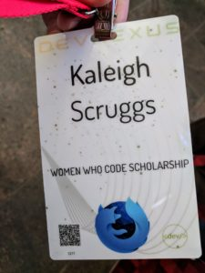
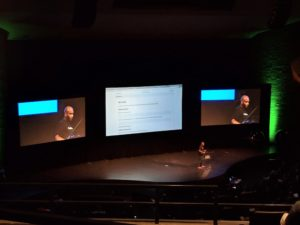

A few months ago, I received the [Code Review](https://mailchi.mp/deee61232ddd/d8icgiexg0-869457?e=18db5746c1), a weekly newsletter from [Women Who Code](https://www.womenwhocode.com/). They were giving out scholarships to attend [DevNexus](https://devnexus.com/), which is a yearly Java conference here in Atlanta. I've been wanting to attend for years but never had the money opportunity. I applied, and a few weeks later, I got an email saying I was chosen for one of their scholarships! I was super excited to be selected to attend DevNexus because if you have ever been to, or just looked up tickets for conferences, you will know how expensive they are.

DevNexus is 2 days (3 if you count the workshops the day before) and offers tons of different tracks and sessions. When I looked at the schedule to figure out which sessions to attend, I was seriously overwhelmed! There are so many! I made a shortlist for each hour and decided I'd make a decision once I was there or have a backup if a room was full. I was glad I did this because there were a few that I walked in, and there were no more open seats.

The conference was Thursday and Friday at the World Congress Center. Thursday morning, after checking in, I attended a Women in Technology breakfast. It was a small session focused on getting more women to submit and speak at conferences. They had a lot of great ideas and really got me thinking!

After breakfast, there was some time before the keynote to check out the booths. There were so many companies to check out and even more free swag to get! I think I got 6 t-shirts in all!

The keynote was really cool, it was presented by 2 engineers at NASA, giving us a little peek into the work they're doing.

After the keynote, it was time for the sessions to begin. Both mornings there was a keynote. Friday's keynote was very entertaining, given by a developer at Google. In between sessions, I was able to go downstairs to the booths and learn about all the companies and pick up some swag. I even got to try some beer made from cloud computing. How crazy!

Something I was not aware of, but of course pleasantly surprised at DevNexus, was that food and drinks were provided. Both days they served all meals, and there was a constant supply of tea, coffee, water, and soda. also had desserts after lunch as well. Not that it's all about the food, but I thought it was worth mentioning since I didn't really see anything related to it online.

Another thing I was not aware of, was that there was a QR code on our badges (well, I obviously learned that when I got mine). This allowed anyone to scan your code and get your information to contact you after DevNexus. I thought this was super cool and made me feel silly about ordering 100 business cards a few weeks before. Oh well...now I have business cards!

And of course, one last thing that was super funny to experience was that the bathroom lines at a tech conference were long for the guys and non-existent for the women. Being a woman in technology has some perks...for now (obviously hoping that we're 50/50 by 2020!).

I am so happy that I got the chance to attend DevNexus after years of wanting to go! Many many thanks to Women Who Code for giving me this opportunity to learn new things and get this experience!

Follow me on [Instagram](https://www.instagram.com/klgh.js/) & [Pinterest](https://www.pinterest.com/kaleighscruggs/)!
