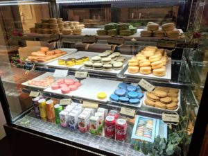
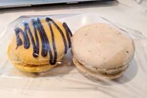
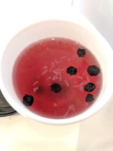
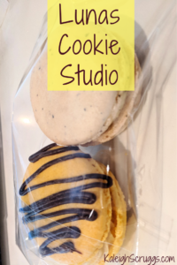

So a little over a month ago I crossed another item off of my [30 Before 30 list](https://kaleighscruggs.com/30-before-30)! This was my visit to [Lunas Cookie Studio](https://lunas-cookie-studio.business.site/) in Suwanee, GA. I pass by pretty much every day, so I was excited to finally stop in and give it a try. I had a few things to work on for a website so I figured it would be the perfect place to get some work done.

When I walked in I was the only one there, so I was able to take my time as I stared at the cookies...which are actually macaroons! I was pleasantly surprised! I had a tough time making a decision because this is what my options looked like:

I decided on the Early Gray and Honey Graham & Chocolate Ganache cookies, or macaroons. I also got a hot blueberry lemon tea which is made in-house. Everything was amazing. First, since the tea is homemade it had lemons and blueberries in it. It tasted so fresh! And the macaroons....they were the bomb. They're a little bit bigger than your standard macaroon (again, definitely not complaining!) and they taste so magical. They're also chilled so they don't break apart when you take your 1st bite. I was planning on eating one in the store and one later, but I couldn't help it and ate both. Whoops.

Also, I didn't get a picture of it, but the store is such a hidden gem. It's pretty big inside so there are tons of places to sit either with friends or if you want to sit and work by yourself. They have great wi-fi and lots of plugs for charging.

I'll definitely be returning to Lunas Cookie Studio because not only is it nearby, but it was just so good...you can't beat good macaroons! If you're in the Duluth area, another good macaroon place is Mac Lab...but that's another post for another day!

Have you been to Lunas Cookie Studio? Do you have another macaroon place I need to check out? Let me know in the comments!

Follow me on [Instagram](https://www.instagram.com/klgh.js/) & [Pinterest](https://www.pinterest.com/kaleighscruggs/)!

