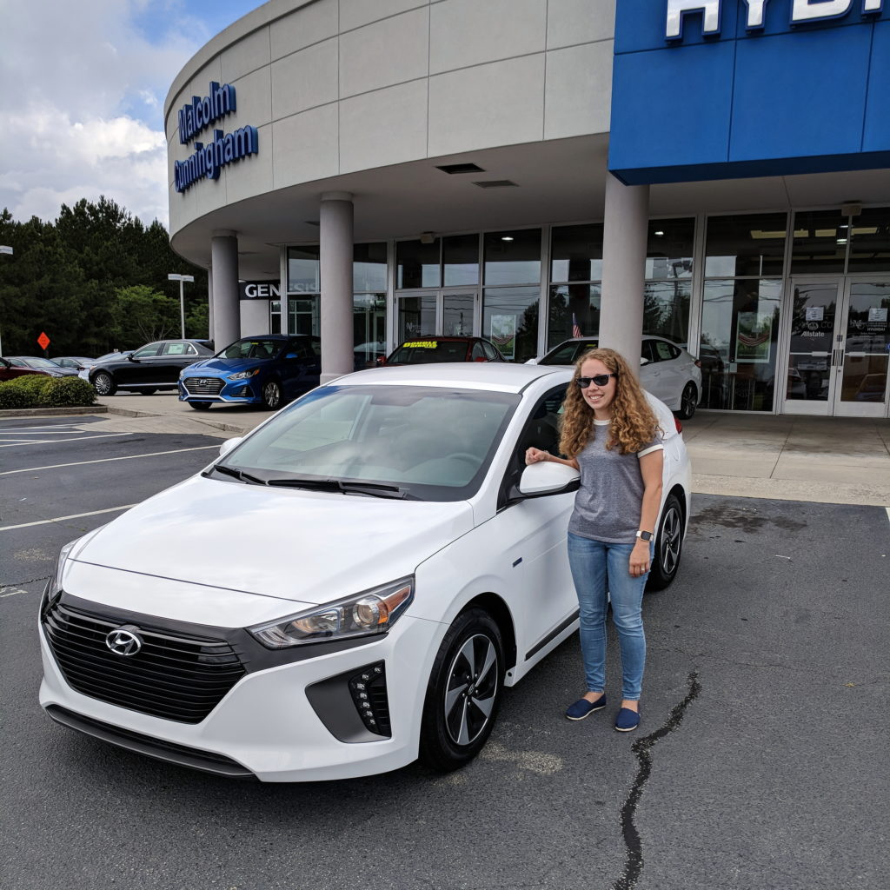
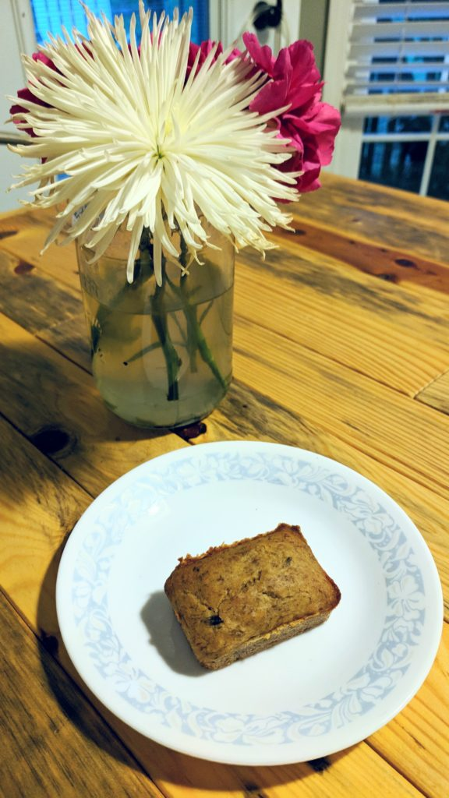
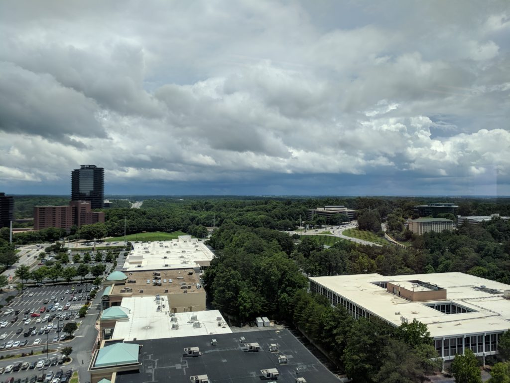

Happy Friday! I've decided to start doing a "Friday Favorites" post every Friday! I figured not only would it help me stay accountable for posting, but also keep track of all the things I love! So welcome to Friday Favorites #1!

First things first...

# My new car!!!

Last Friday I traded in my Kia Soul EV for a Hyundai Ioniq Hybrid! The past few months I have been doing tons of research trying to figure out what my next car would be. My lease on the Soul EV was up in June, and I knew I didn't want to buy it (not to mention I was over my miles and the battery wasn't as good as it used to be). I knew I wanted a hybrid, but there are so many now, all with different features and of course, at different price points.

I _finally_ settled on the Ioniq and found a great deal on the Edmunds app on my (brand new) 2017 Ioniq. After a lot of discussions, I also decided to finance the car instead of leasing again. What ultimately sold me on financing was when I calculated how much I have to pay Kia for going over my miles...ouch!! But I'll worry about that later because this is definitely my favorite thing this past week!

# Banana Bread

I tried a [new banana bread recipe](https://www.whereyougetyourprotein.com/vegan-banana-bread/) this week and love it! I did modify it by halving it since I only had 2 bananas, didn't use walnuts, and also used gluten-free flour. This recipe is vegan, low-fodmap, gluten-free, and dairy-free so Shaun and I can eat it as well as anyone else (pretty much). I used my [small rectangular silicone baking mold](https://www.amazon.com/gp/product/B01K02IDJ2/ref=as_li_ss_tl?ie=UTF8&psc=1&linkCode=ll1&tag=kaleigh-20&linkId=16bf5dbd5bb712b9c0787684977f3135&language=en_US) to get them so cute and tiny. If you haven't been using silicone to bake with, you're missing out. They're my favorite thing to bake with now!

# No Rain

It's been raining for at least 2 weeks now, and I'm about over it. So anytime it's not raining is pretty great. I'm super tired of the humidity, and the water that's been slowly leaking into our garage. I can't wait to finally enjoy the warm weather without everything being wet!

\[caption id="attachment\_1147" align="aligncenter" width="1024"\] rain in the distance :(\[/caption\]

A short list for a short week, but I'll be back next week, so be sure to follow me on Instagram or sign up for my emails so you don't miss it!

Follow me on [Instagram](https://www.instagram.com/klgh.js/) & [Pinterest](https://www.pinterest.com/kaleighscruggs/)!
